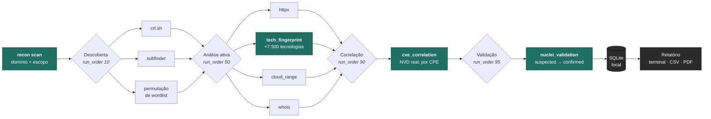

<div align="center">

# Web Application Reconnaissance &amp; Investigation Platform

### Aponte para um domínio. Receba a tecnologia exata, a versão exata, e CVEs reais.

Uma CLI ofensiva de reconhecimento que mapeia a superfície de ataque de um
alvo autorizado — descoberta de subdomínios, fingerprint ativo de
tecnologias e correlação de vulnerabilidades contra a NVD real — tudo em
um único processo síncrono, sem servidor, sem fila, sem infraestrutura
para manter no ar.

[](https://www.python.org/)
[](#referência-de-comandos)
[](#testes)
[](LICENSE)
[](#autorização-e-uso-responsável)

<br>

[Visão geral](#o-que-a-ferramenta-faz) ·
[Tutorial](#tutorial-do-zero-ao-primeiro-scan) ·
[Comandos](#referência-de-comandos) ·
[Arquitetura](#como-funciona-por-dentro) ·
[Roadmap](#roadmap)

</div>

<br>

> [!IMPORTANT]
> Esta é uma ferramenta ofensiva. Ela envia requisições reais contra
> qualquer alvo que você fornecer — descoberta de subdomínios, sondagem
> HTTP direta, resolução DNS. **Use apenas contra sistemas que você
> possui ou tem autorização explícita e documentada para testar** (um
> pentest contratado, um bug bounty com escopo definido, seus próprios
> sistemas, ou domínios públicos de teste como `example.com`).

---

## Sumário

| | | |
|---|---|---|
| [O que a ferramenta faz](#o-que-a-ferramenta-faz) | [Tutorial: do zero ao primeiro scan](#tutorial-do-zero-ao-primeiro-scan) | [Problemas comuns](#problemas-comuns) |
| [Referência de comandos](#referência-de-comandos) | [Autorização e uso responsável](#autorização-e-uso-responsável) | [Como funciona por dentro](#como-funciona-por-dentro) |
| [Catálogo de módulos](#catálogo-de-módulos) | [Fingerprint de tecnologias](#fingerprint-de-tecnologias) | [Correlação de CVE](#correlação-de-cve) |
| [Configuração](#configuração) | [Dados e persistência](#dados-e-persistência) | [Trilha de auditoria](#trilha-de-auditoria) |
| [Testes](#testes) | [Limitações conhecidas](#limitações-conhecidas) | [Roadmap](#roadmap) |

---

## O que a ferramenta faz

Você fornece um domínio. A ferramenta:

**1. Descobre** subdomínios — certificate transparency, enumeração
passiva agregada, permutação de wordlist sobre o que já foi encontrado.

**2. Sonda ativamente** o alvo e cada subdomínio contra um motor de
fingerprint orientado por dados — mais de **7.500 tecnologias** via um
dataset vendorizado do Wappalyzer — extraindo a **versão exata** sempre
que ela vaza por headers, cookies, tags `generator` ou arquivos de
changelog/manifest expostos.

**3. Correlaciona** cada tecnologia com versão conhecida contra a API
real da NVD, filtrando por faixa de CPE — não é busca textual solta, é
verificação estrutural de que aquela versão específica realmente cai
dentro da faixa vulnerável da CVE.

**4. Valida ativamente** um subconjunto das CVEs correlacionadas via
templates comunitários do `nuclei`, promovendo o status de `suspected`
para `confirmed` quando a exploração é reproduzida de forma segura.

**5. Imprime um relatório** no terminal, agrupado por Tecnologias, CVEs
(ordenadas por CVSS decrescente, severidade colorida) e outros achados —
e grava tudo em um banco SQLite local para você revisitar depois.

Sem frontend, sem API HTTP, sem Celery, sem Redis, sem Docker.
**Um comando, um processo, um relatório.**



---

## Tutorial: do zero ao primeiro scan

Este tutorial assume que você **nunca rodou a ferramenta antes**. Siga
na ordem — cada passo tem uma forma de confirmar que funcionou antes de
seguir pro próximo. Se algo não bater com o descrito, vá direto para
[Problemas comuns](#problemas-comuns).

Escolha sua plataforma: [Windows (PowerShell)](#passo-0--abra-o-terminal-certo)
é o mais detalhado, já que é onde mais gente trava; macOS/Linux acompanha
em cada passo.

### Passo 0 — Abra o terminal certo

**Windows:** abra o **PowerShell** (não o "Prompt de Comando"/`cmd`).
Menu Iniciar → digite `PowerShell` → Enter.

**macOS/Linux:** abra o Terminal normal.

### Passo 1 — Confirme que o Python está instalado (versão 3.13 ou mais recente)

```powershell
python --version
```

Resultado esperado: algo como `Python 3.13.12`. Se aparecer
**`'python' não é reconhecido como um comando`**, tente:

```powershell
py --version
```

Se nenhum dos dois funcionar, você não tem Python instalado — baixe em
[python.org/downloads](https://www.python.org/downloads/) (marque a
caixa **"Add Python to PATH"** durante a instalação — este é o passo que
mais gente esquece) e repita este passo.

> Daqui em diante este tutorial usa `python`. Se só `py` funcionou na sua
> máquina, troque `python` por `py` em todos os comandos abaixo.

### Passo 2 — Baixe o código

```powershell
git clone https://github.com/excanear/Web-Application-Reconnaissance-Investigation-Platform.git
```

Se você não tem `git` instalado, baixe o ZIP direto pelo botão verde
**"Code" → "Download ZIP"** na página do repositório no GitHub, e
extraia a pasta.

### Passo 3 — Entre na pasta certa

Este é o passo onde **quase todo mundo trava**: os comandos da
ferramenta só funcionam de dentro da pasta `backend/`, não da raiz do
projeto.

```powershell
cd Web-Application-Reconnaissance-Investigation-Platform\backend
```

**Confirme que está no lugar certo antes de continuar:**

```powershell
dir
```

Você precisa ver `app`, `tests`, `requirements.txt` na listagem. Se não
aparecer, você está na pasta errada — ajuste o `cd`.

*(macOS/Linux: mesma ideia, só troque `dir` por `ls` e `\` por `/` no
caminho.)*

### Passo 4 — Crie um ambiente virtual e instale as dependências

Um ambiente virtual (`venv`) isola os pacotes desta ferramenta do resto
do seu sistema — evita conflito de versões e, em Linux/macOS recentes, é
**obrigatório** (o Python do sistema recusa instalar pacotes
diretamente; veja
[`externally-managed-environment`](#erro-externally-managed-environment)
em Problemas comuns se você pular este passo e cair nesse erro).

```powershell
# Windows (PowerShell)
python -m venv venv
.\venv\Scripts\Activate.ps1
pip install -r requirements.txt
```

```bash
# macOS/Linux
python3 -m venv venv
source venv/bin/activate
pip install -r requirements.txt
```

**Como saber que o ambiente virtual está ativo:** o início da linha do
terminal passa a mostrar `(venv)` antes do resto do prompt. Enquanto
`(venv)` estiver lá, `python` e `pip` apontam para o ambiente isolado —
é assim que deve aparecer toda vez que você usar a ferramenta (se fechar
o terminal, é só repetir o passo de ativação:
`.\venv\Scripts\Activate.ps1` ou `source venv/bin/activate` — não
precisa recriar o venv).

Isso baixa e instala: `sqlalchemy`, `typer`, `rich`, `requests`,
`python-whois`, `python-dotenv`, `reportlab`, `pytest`. Leva menos de um
minuto.

**Como saber que funcionou:** a última linha no terminal deve ser algo
como `Successfully installed ...` listando os pacotes.

Em seguida, instale a própria ferramenta em modo editável, o que
registra o comando `webscan` no `venv`:

```powershell
pip install -e .
```

Com `(venv)` ativo, `webscan` passa a existir como comando direto —
não precisa mais digitar `python -m app.cli` (mas isso continua
funcionando, se preferir).

### Passo 5 — Rode seu primeiro scan

Agora o comando principal da ferramenta. Vamos usar `example.com`, o
domínio de exemplo reservado pela IANA, seguro para qualquer um testar:

```powershell
webscan scan example.com --scope "meu primeiro teste" --authorized --confirm-active
```

**O que esperar na tela**, em ordem:

```text
Running crtsh...
Running subfinder...
Running subdomain_permutation...
Running cloud_range...
Running httpx_probe...
Running tech_fingerprint...
Running whois...
Running cve_correlation...
```

Isso leva de 10 a 40 segundos (a ferramenta está fazendo requisições de
rede de verdade — não travou, isso é o `cve_correlation` respeitando o
limite de taxa da API da NVD). No fim, o relatório aparece em tabelas.

**Se você chegou até aqui e viu o relatório final — funcionou.**
Parabéns, a ferramenta está instalada e operando.

### Passo 6 — Rode contra o seu próprio alvo

Troque `example.com` pelo domínio que você está autorizado a testar, e
`"meu primeiro teste"` por uma descrição de escopo real:

```powershell
webscan scan seudominio.com --scope "pentest autorizado - contrato XYZ" --authorized --confirm-active
```

Depois, veja tudo que você já rodou:

```powershell
webscan history
```

E reimprima o relatório de um scan específico (troque `1` pelo número
da coluna `ID` do `history`):

```powershell
webscan report 1
```

### Modo interativo (shell)

Rodar `webscan` sozinho, sem nenhum subcomando, abre um shell
interativo — parecido com entrar numa ferramenta como o `claude`. Você
digita os comandos sem repetir `webscan` toda vez, e sai com `exit`,
`quit` ou Ctrl+D:

```text
$ webscan
webscan interactive shell. Type a command (e.g. 'history'), 'help' for options, or 'exit' to quit.
webscan> history
...
webscan> scan example.com --scope "meu primeiro teste" --authorized --confirm-active
...
webscan> report 1
...
webscan> exit
```

Dentro do shell, `help` (ou `?`) lista os comandos disponíveis, e um
comando com erro (opção inválida, comando inexistente, scan sem
`--authorized` etc.) mostra a mensagem de erro e volta pro prompt — não
derruba a sessão. Ctrl+C cancela a linha atual sem fechar o shell.

---

## Problemas comuns

<details>
<summary><strong><code>ModuleNotFoundError: No module named 'app'</code></strong></summary>
<br>

Você rodou o comando de fora da pasta `backend/`. Volte ao
[Passo 3](#passo-3--entre-na-pasta-certa): rode `cd backend` (ajuste o
caminho pra onde você está) e confirme com `dir`/`ls` que `app`,
`tests`, `requirements.txt` aparecem antes de tentar de novo.

</details>

<details>
<summary><strong><code>'python' não é reconhecido como um comando</code></strong></summary>
<br>

Duas causas possíveis:
1. Python não está instalado — instale em
   [python.org/downloads](https://www.python.org/downloads/), marcando
   **"Add Python to PATH"**.
2. Python está instalado mas só responde a `py` — troque `python` por
   `py` em todos os comandos.

</details>

<details>
<summary><strong>PowerShell se recusa a rodar um script <code>.ps1</code></strong></summary>
<br>

Se você tentar rodar `.\scripts\install.ps1` (o script opcional dos
módulos `subfinder`/`httpx`, veja
[Referência de comandos](#instalar-subfinder-e-httpx-opcional)) e vir:

```text
não pode ser carregado porque a execução de scripts foi desabilitada neste sistema
```

Rode isto uma vez (permite scripts baixados só pro seu usuário, não muda
mais nada no sistema):

```powershell
Set-ExecutionPolicy -Scope CurrentUser RemoteSigned
```

Confirme com `S` quando perguntado, e tente rodar o script de novo.

</details>

<details>
<summary><strong>Erro dizendo que <code>--authorized</code> ou <code>--confirm-active</code> está faltando</strong></summary>
<br>

**Isso não é um bug — é a trava de segurança da ferramenta funcionando
como deveria.** Ela recusa criar um scan sem essas duas confirmações
explícitas (veja [Autorização e uso responsável](#autorização-e-uso-responsável)).
Adicione as duas flags no fim do comando:

```powershell
webscan scan example.com --scope "teste" --authorized --confirm-active
```

</details>

<details>
<summary><strong>O comando parece travado, não imprime nada por um tempo</strong></summary>
<br>

Normal nos primeiros 10-40 segundos — a ferramenta está mesmo fazendo
requisições de rede ao vivo (DNS, HTTP, consultas à NVD). Se passar de
uns 2 minutos sem nenhuma linha nova, pode ser um alvo com muitos
subdomínios ou rede lenta; espere mais um pouco antes de interromper com
`Ctrl+C`.

</details>

<details>
<summary><strong>Erro <code>externally-managed-environment</code></strong></summary>
<br>

```text
error: externally-managed-environment

× This environment is externally managed
╰─> To install Python packages system-wide, try apt install
    python3-xyz, where xyz is the package you are trying to
    install...
```

Isso acontece quando você tenta `pip install` **fora** de um ambiente
virtual, num Python instalado pelo gerenciador de pacotes do sistema
(comum em Ubuntu/Debian recentes e em Python instalado via Homebrew no
macOS). O Python recusa instalar pacotes diretamente no sistema pra não
quebrar outras ferramentas que dependem dele.

**A correção é o [Passo 4](#passo-4--crie-um-ambiente-virtual-e-instale-as-dependências):**
crie e ative um ambiente virtual antes de rodar `pip install`:

```bash
python3 -m venv venv
source venv/bin/activate
pip install -r requirements.txt
```

Confirme que `(venv)` apareceu no início da linha do terminal antes de
instalar — é isso que indica que o ambiente virtual está ativo e o
`pip install` vai parar de reclamar.

> Existe uma forma de forçar a instalação sem ambiente virtual
> (`pip install --break-system-packages -r requirements.txt`), mas ela
> tem esse nome por um motivo — pode quebrar outras ferramentas Python
> no seu sistema. Use o ambiente virtual; leva 10 segundos a mais e
> evita esse risco.

</details>

<details>
<summary><strong>Erro de permissão ao instalar dependências</strong></summary>
<br>

Se o `pip install` falhar por permissão mesmo dentro de um ambiente
virtual ativado (raro, mas acontece se o próprio `venv` foi criado numa
pasta sem permissão de escrita), apague a pasta `venv` e recrie em algum
lugar onde seu usuário tem permissão total — por exemplo, dentro da sua
pasta pessoal (`Documentos`, `home`), não em pastas do sistema.

</details>

<details>
<summary><strong><code>'pip' não é reconhecido como um comando</code></strong></summary>
<br>

Com o ambiente virtual ativado (passo 4), isso não deveria acontecer. Se
acontecer mesmo assim, troque `pip install` por `python -m pip install`
(ou `python3 -m pip install` no macOS/Linux).

</details>

<details>
<summary><strong><code>module_error</code> para <code>subfinder</code> ou <code>httpx_probe</code> no relatório</strong></summary>
<br>

Esperado se você não instalou as ferramentas Go externas — elas são
opcionais. O resto do scan continua funcionando normalmente (`crtsh`,
`whois`, `tech_fingerprint`, `cve_correlation` são Python puro, não
dependem delas). Se quiser instalá-las mesmo assim, veja
[Referência de comandos](#instalar-subfinder-e-httpx-opcional).

</details>

<details>
<summary><strong><code>sqlite3.OperationalError: database is locked</code> ou erro ao apagar o <code>dev.db</code></strong></summary>
<br>

Outra instância da ferramenta ainda está rodando (ou travada) segurando
o arquivo `dev.db`. Feche qualquer terminal onde a ferramenta esteja
rodando e tente de novo. No Windows, se persistir, reinicie o terminal.

</details>

<details>
<summary><strong>Nada disso resolveu</strong></summary>
<br>

Abra uma [issue no repositório](https://github.com/excanear/Web-Application-Reconnaissance-Investigation-Platform/issues)
com: o comando exato que você rodou, a mensagem de erro completa, e o
resultado de `python --version`.

</details>

---

## Referência de comandos

### Instalar `subfinder` e `httpx` (opcional)

Ferramentas Go externas, usadas pelos módulos de mesmo nome. Exigem
[Go](https://go.dev/dl/) instalado. Sem elas, esses dois módulos
específicos registram `module_error` e o resto do scan continua
normalmente — instalá-las não é obrigatório para usar a ferramenta.

```powershell
# Windows (de dentro de backend/)
.\scripts\install.ps1
```

```bash
# Linux/macOS (de dentro de backend/)
./scripts/install.sh
```

### Instalar `nuclei` (opcional, necessário para validação de CVE)

`nuclei_validation` confirma ativamente um subconjunto dos achados de
CVE `suspected` rodando templates comunitários do `nuclei` casados por
ID de CVE contra o alvo. Sem o `nuclei` instalado, esse módulo registra
um único achado `module_error` e toda CVE fica `suspected` — o resto do
scan não é afetado.

1. Instale o `nuclei`: https://github.com/projectdiscovery/nuclei#install-nuclei
2. Atualize sua biblioteca de templates (obrigatório — a ferramenta
   nunca vendoriza templates): `nuclei -update-templates`
3. Rode `nuclei -update-templates` periodicamente para pegar templates
   de CVEs recém-divulgadas.

Toda invocação do `nuclei` exclui templates com tag `dos`, `fuzz` e
`intrusive` incondicionalmente — é um limite de segurança fixo no
código, não uma configuração.

### Atualizar o dataset de fingerprint de tecnologias

`tech_fingerprint` detecta tecnologias usando uma cópia vendorizada do
dataset do [Wappalyzer](https://github.com/enthec/webappanalyzer)
(milhares de tecnologias, fork mantido pela comunidade do projeto
Wappalyzer original) mais um pequeno conjunto de sondas ativas próprias
do projeto (hoje só o `/CHANGELOG.txt` do WordPress, pra precisão de
versão além do que uma checagem passiva oferece).

O dataset vendorizado (`backend/app/data/technologies.json`,
`backend/app/data/categories.json`) vem junto com o repositório mas
fica desatualizado com o tempo. Atualize com:

```
recon update-fingerprints
```

É uma operação de manutenção local — não toca em nenhum alvo, não
precisa de `--authorized`/`--confirm-active`, mesma postura do `nuclei
-update-templates`. Uma falha de rede deixa os arquivos vendorizados
existentes intocados.

> [!NOTE]
> **Limitações conhecidas:** só tecnologias detectáveis a partir de uma
> única resposta HTTP (headers/cookies/meta tags/corpo HTML/URLs de
> `<script src>`) são suportadas. Entradas do Wappalyzer que só oferecem
> checagens `js` (variável JavaScript global), `dom` (seletor de
> elemento) ou `css` (estilo computado) exigem uma página realmente
> renderizada e são ignoradas por completo — esta ferramenta nunca roda
> um navegador. Tecnologias recém-detectadas cujo nome de exibição não
> bate com o nome de produto no CPE da NVD ainda não correlacionam
> CVE — gap conhecido, não é bug.

Os dados do Wappalyzer têm licença CC BY-SA 4.0 dos seus contribuidores;
a cópia vendorizada neste repositório é um espelho direto, sem
modificações.

### Configurar uma chave de API da NVD (opcional, recomendado)

Sem uma chave, o limite de consulta à NVD é de 5 requisições a cada 30
segundos. Com uma chave gratuita, sobe para 50/30s — scans com muitas
tecnologias ficam bem mais rápidos.

```powershell
copy .env.example .env
```

Abra o `.env` num editor de texto e preencha `NVD_API_KEY=` com uma
chave gratuita obtida em
[nvd.nist.gov/developers/request-an-api-key](https://nvd.nist.gov/developers/request-an-api-key).
O `.env` nunca é commitado no git (já coberto pelo `.gitignore`).

### Idioma de saída

Por padrão a CLI imprime tudo em inglês. Para saída em português, use
`--lang pt` **antes** do nome do comando:

```bash
webscan --lang pt scan <alvo> --scope "<descrição do escopo autorizado>" --authorized --confirm-active
```

### Rodar um scan

```bash
webscan scan <alvo> --scope "<descrição do escopo autorizado>" --authorized --confirm-active
```

| Flag | Obrigatória | O que faz |
|---|---|---|
| `<alvo>` (argumento posicional) | sim | Domínio a mapear |
| `--scope` | sim | Descrição textual do escopo autorizado — salva no registro do projeto |
| `--authorized` | sim | Confirmação explícita de que você está autorizado a testar o alvo |
| `--confirm-active` | sim (se houver módulos ativos registrados) | Confirmação de que módulos que sondam o alvo diretamente podem rodar |
| `--name` | não | Nome do projeto (padrão: o próprio alvo) |
| `--max-requests-per-second` | não | Limita o ritmo de requisições contra o alvo/subdomínios (padrão `5.0`) |
| `--circuit-breaker-threshold` | não | Falhas consecutivas contra um alvo antes de um módulo parar de sondá-lo (padrão `5`) |
| `--max-workers` | não | Processa até essa quantidade de hosts em paralelo dentro de `tech_fingerprint`/`cloud_range` (padrão `1` — totalmente sequencial, idêntico a qualquer scan anterior a essa flag) |
| `--scope-include` | não | Padrão de domínio ou CIDR explicitamente dentro do escopo (repetível, padrão `<alvo>` e `*.<alvo>`) |
| `--scope-exclude` | não | Padrão de domínio ou CIDR explicitamente excluído (repetível) |
| `--scope-window` | não | Janela de horário UTC permitida, ex. `09:00-18:00` (padrão: sempre permitido) |

Omitir qualquer flag obrigatória interrompe a execução **antes** de
qualquer requisição atingir o alvo, com uma mensagem de erro explicando
o que falta.

`tech_fingerprint` e `cloud_range` pacificam cada host e param de sondar
um alvo que falha repetidamente, registrando um achado
`circuit_breaker_tripped` em vez de continuar às cegas. `httpx_probe`
repassa o mesmo ritmo pro próprio `-rate-limit` do `httpx`.
`cve_correlation` respeita o limite geral por cima do próprio pacing
específico da NVD. `crtsh` e `whois` fazem exatamente uma requisição por
scan, então nenhuma dessas travas se aplica a eles.

`--max-workers` só afeta `tech_fingerprint` e `cloud_range` — os dois
módulos com um loop por host em Python. O `httpx_probe` já paraleliza
internamente via o próprio `-rate-limit` do binário externo `httpx`; o
`cve_correlation` é limitado pelo próprio teto de requisições da API da
NVD, independente de paralelismo local, então continua sequencial.
Aumentar `--max-workers` **não** aumenta `--max-requests-per-second` —
só permite que essa quantidade de requisições em voo compartilhe o
mesmo orçamento de ritmo, em vez de uma requisição terminar
completamente antes da próxima começar, encurtando o tempo de parede em
escopos grandes sem enviar mais requisições por segundo. No padrão `1`,
os resultados (ordem dos achados, qual host dispara um trip do circuit
breaker, a contagem de `skipped_hosts`) são idênticos byte a byte a
antes dessa flag existir. Com `--max-workers` acima de `1`, essa
contabilidade continua totalmente determinística — só a ordem das
entradas do `recon audit` para hosts processados no mesmo lote pode
variar entre execuções, nunca o conteúdo.

Módulos que sondam um host checam o escopo declarado primeiro — um host
fora de escopo que um módulo tocaria de outra forma é pulado e
registrado como achado `out_of_scope`. Se restringir o escopo com
`--scope-include` excluiria o próprio alvo, `scan` recusa criar o
projeto por completo.

### Ver histórico

```bash
webscan history
```

Lista todo scan já rodado (id, projeto, alvo, status, data).

### Reimprimir um relatório

```bash
webscan report <scan_id>
```

Reimprime o relatório formatado de um scan já concluído, sem rodar nada
de novo — útil para revisitar um resultado sem gastar novas requisições
contra o alvo ou a NVD.

### Exportar um relatório

`recon report <scan_id>` por padrão gera a tabela no terminal mostrada
acima. Dois formatos adicionais estão disponíveis:

- `recon report <scan_id> --format csv` — uma linha por achado de CVE
  (`cve, severity, cvss, epss, status, technology, host, description,
  evidence, remediation`), escrita no stdout. Os nomes das colunas são
  fixos e em inglês independente de `--lang`, seguindo a mesma
  convenção do `recon audit --format csv` — CSV é para
  máquinas/planilhas, não para o idioma de exibição da CLI.
- `recon report <scan_id> --format pdf [--output CAMINHO]` — um PDF
  autocontido (resumo executivo, tecnologias detectadas e CVEs
  priorizadas por CVSS com EPSS como desempate), localizado conforme
  `--lang`. Sem `--output`/`-o`, o arquivo é gravado como
  `report_<scan_id>.pdf` no diretório atual. Gerar o PDF não exige
  instalação de ferramenta externa — `reportlab` é uma dependência
  Python pura já fixada no `requirements.txt`, diferente de
  `nuclei`/`subfinder`/`httpx`.

O score EPSS (probabilidade de exploração, da API pública gratuita da
FIRST.org) de cada CVE é buscado e gravado uma única vez, no momento do
scan, do mesmo jeito que os dados de NVD/DeepL já são — os comandos
`report`/export nunca tocam a rede. CVSS continua sendo o sinal
principal de prioridade; EPSS só desempata CVEs que já compartilham a
mesma nota CVSS.

A recomendação de remediação vem do próprio texto `remediation` do
template `nuclei` que confirmou, quando o status da CVE é `confirmed`;
caso contrário, uma mensagem genérica de "atualize para uma versão
corrigida" nomeia a tecnologia afetada sem chutar um número de versão
específico.

### Ver a trilha de auditoria

```bash
webscan audit <scan_id> --format table
webscan audit <scan_id> --format csv > audit.csv
```

Lista toda `AuditEntry` registrada de um scan — módulo, alvo, URL,
resultado, timestamp. `table` (padrão) segue o mesmo estilo Rich do
`report`; `csv` escreve no stdout via o módulo `csv` da stdlib (sem
flag `--output`). Veja [Trilha de auditoria](#trilha-de-auditoria) para
o que é registrado e por quê.

<details>
<summary><strong>Ver <code>--help</code> completo</strong></summary>

```text
$ webscan --help

Usage: webscan [OPTIONS] COMMAND [ARGS]...

 Recon & Investigation CLI

+- Options -------------------------------------------------------------------+
| --lang                      <str>  Output language: en (default) or pt      |
|                                    [default: en]                            |
+-----------------------------------------------------------------------------+
+- Commands ------------------------------------------------------------------+
| scan                                                                        |
| history                                                                     |
| update-fingerprints                                                         |
| report                                                                      |
| audit                                                                       |
+-----------------------------------------------------------------------------+
```

</details>

---

## Autorização e uso responsável

A ferramenta impõe duas travas técnicas, não só uma recomendação:

1. **`--authorized`** — obrigatória em todo `scan`. Sem essa flag,
   nenhum projeto é criado e nenhuma requisição sai da sua máquina.
2. **`--confirm-active`** — obrigatória sempre que um módulo está
   marcado como ativo no registro (`httpx_probe` e `tech_fingerprint`
   hoje — eles enviam requisições HTTP reais diretamente contra o alvo,
   diferente de módulos passivos como `crtsh` ou `whois`, que consultam
   serviços de terceiros).

Todo projeto grava seu `scope_notes` — a descrição de escopo que você
forneceu — junto com os resultados, então o histórico de scans carrega o
registro da autorização declarada.

## Como funciona por dentro

```text
recon scan → cria Project + Scan (SQLite)
           → orchestrator.run_scan(scan_id)
                → itera MODULE_REGISTRY ordenado por run_order
                     10  descoberta     (crtsh, subfinder, subdomain_permutation)
                     50  análise        (cloud_range, httpx_probe, tech_fingerprint, whois)
                     90  correlação     (cve_correlation)
                     95  validação      (nuclei_validation)
                → cada módulo recebe (target, context) e devolve Finding[]
                → context["subdomains"] e context["technologies"] acumulam
                  conforme os módulos rodam, alimentando os próximos
                → todo Finding é persistido, isolado por módulo — um
                  módulo quebrado vira um Finding module_error, o scan continua
           → a CLI imprime o relatório agrupado
```

O núcleo é um **registro de plugins**: cada módulo é uma classe Python
decorada com `@register_module`, com um atributo `run_order` (controla
quando roda) e `is_active` (controla se exige `--confirm-active`).
Adicionar um módulo novo não exige tocar no orquestrador — só criar o
arquivo e importá-lo em `app/modules/__init__.py`.

## Catálogo de módulos

| Módulo | `run_order` | Ativo? | O que faz |
|---|:---:|:---:|---|
| `crtsh` | 10 | — | Consulta logs públicos de certificate transparency (crt.sh) por subdomínios que apareceram em certificados SSL emitidos |
| `subfinder` | 10 | — | Agrega subdomínios de múltiplas fontes passivas via a ferramenta externa `subfinder` |
| `subdomain_permutation` | 10 | — | Gera candidatos combinando uma wordlist de nomes comuns (dev, staging, admin, api, vpn...) com subdomínios já descobertos |
| `cloud_range` | 50 | — | Resolve cada host via DNS e verifica se o IP cai dentro de uma faixa conhecida da AWS/GCP/Azure |
| `httpx_probe` | 50 | **sim** | Visita cada host candidato via HTTP real, confirma quais estão vivos, faz fingerprinting básico via `httpx -tech-detect` |
| `tech_fingerprint` | 50 | **sim** | Detecção de tecnologia orientada por Wappalyzer com sondas de path ativas — veja a seção dedicada abaixo |
| `whois` | 50 | — | Consulta os dados reais de registro do domínio |
| `cve_correlation` | 90 | — | Correlaciona cada tecnologia com versão conhecida contra a API real da NVD |
| `nuclei_validation` | 95 | **sim** | Roda templates `nuclei` casados por ID de CVE contra achados `suspected`, excluindo templates com tag `dos`/`fuzz`/`intrusive` |

"Ativo" = envia requisições diretamente contra o alvo/subdomínios, além
de só consultar serviços de terceiros. Módulos ativos exigem
`--confirm-active`.

## Fingerprint de tecnologias

`tech_fingerprint` detecta tecnologias usando uma cópia vendorizada do
dataset do [Wappalyzer](https://github.com/enthec/webappanalyzer)
(milhares de tecnologias, mantido pela comunidade) mais sondas ativas
próprias do projeto. Veja
[Atualizar o dataset de fingerprint de tecnologias](#atualizar-o-dataset-de-fingerprint-de-tecnologias)
acima para como atualizar o dataset e suas limitações conhecidas.

Fingerprint de banco de dados é deliberadamente limitado a sinais
indiretos (cookies, headers, mensagens de erro já expostas) — detecção
direta via técnicas de injeção é teste de vulnerabilidade, não
reconhecimento, e está fora do escopo desta ferramenta.

## Correlação de CVE

`cve_correlation` não faz busca por frase exata contra a NVD — essa
abordagem foi testada ao vivo e descartada porque retornava quase zero
resultados reais (a maioria das descrições de CVE não cita a versão
como texto literal). A abordagem real:

1. Busca por palavra-chave só no **nome** da tecnologia
   (`keywordSearch=nginx`).
2. Para cada CVE retornada, lê a lista `configurations` que a NVD anexa
   — as faixas de CPE (`versionStartIncluding`, `versionEndExcluding`,
   etc.) que definem quais versões estão realmente afetadas.
3. Só reporta a CVE se a versão detectada realmente cair dentro da faixa
   (ou bater exatamente com uma versão fixada no CPE, quando não há
   faixa).

Validado ao vivo: `nginx 1.18.0` retorna corretamente **46 CVEs reais**
contra a API de produção da NVD.

A coluna **Status** de cada CVE no relatório mostra `suspected` ou
`confirmed`. `suspected` significa que a versão cai dentro da faixa de
CPE da CVE segundo a NVD — resultado só da correlação estrutural.
`confirmed` significa que `nuclei_validation` rodou um template
mantido pela comunidade para aquela CVE contra o alvo e o template
reportou um resultado positivo, confirmando que a vulnerabilidade pode
realmente ser reproduzida via uma checagem segura (sem exploração,
só detecção). A coluna **Evidence** para CVEs confirmadas mostra qual ID
de template do `nuclei` bateu e em qual timestamp.

## Configuração

Variáveis de ambiente lidas de `backend/.env` (nunca commitado — já
coberto pelo `.gitignore`):

| Variável | Obrigatória | Padrão | Descrição |
|---|:---:|---|---|
| `DATABASE_URL` | não | `sqlite:///./dev.db` | String de conexão SQLAlchemy. SQLite local por padrão — funciona sem nenhum banco externo |
| `NVD_API_KEY` | não | (nenhuma) | Eleva o limite de requisições à NVD de 5/30s para 50/30s. Gratuita em nvd.nist.gov |
| `DEEPL_API_KEY` | não | (nenhuma) | Ativa a tradução para português das descrições de CVE da NVD. Nível gratuito em deepl.com. Sem ela, as descrições de CVE ficam só em inglês e o relatório marca a célula em português como indisponível quando `--lang pt` é usado |

## Dados e persistência

Quatro tabelas SQLite (`app/models.py`):

```text
Project(id, name, target, scope_notes, authorized, authorized_at, created_at)
Scan(id, project_id, status, started_at, finished_at)
Finding(id, scan_id, module, type, value, data:JSON, created_at)
AuditEntry(id, scan_id, module, target, url, outcome, requested_at)
```

`Finding.type` inclui hoje: `subdomain`, `whois`, `live_host`,
`technology`, `cve`, `cloud_asset`, `module_error`,
`circuit_breaker_tripped`, `out_of_scope`, `scope_window_closed`.
`Finding.data` guarda o payload específico do tipo (categoria/versão/
confiança para tecnologia; CVSS/severidade/descrição para CVE, etc).

## Trilha de auditoria

Toda requisição de rede real que a ferramenta faz — contra o alvo/
subdomínios e contra serviços de terceiros como a NVD — é registrada
como uma `AuditEntry`: módulo, alvo, URL (quando aplicável), resultado e
timestamp. Isso é separado do relatório de achados; existe para provar
o que a ferramenta realmente tocou, independente do que virou um
achado. `subfinder` e `httpx_probe` chamam binários Go externos e não
enxergam as requisições individuais que esses binários fazem
internamente, então recebem uma entrada por invocação/por host
respectivamente — uma aproximação aceita, não fidelidade literal por
socket.

```bash
webscan audit <scan_id> --format table
webscan audit <scan_id> --format csv > audit.csv
```

## Testes

```bash
cd backend
pytest -v
```

**243 testes**, cobrindo cada módulo isoladamente (mockando chamadas
externas), o orquestrador (isolamento de falha por módulo, ordenação
por `run_order`, propagação de contexto), comportamento de rate
limiting/circuit breaker sob concorrência real (múltiplas threads
disputando os mesmos primitivos compartilhados), e a CLI
(`typer.testing.CliRunner`, mockando o orquestrador para não depender da
rede).

## Limitações conhecidas

- **`subfinder`/`httpx` exigem instalação manual** de ferramentas Go
  externas — sem elas, esses dois módulos específicos ficam limitados
  (viram `module_error`, o resto do scan continua normal).
- **Sem cache de CVE** — toda consulta à NVD é uma chamada de rede nova,
  mesmo repetindo o mesmo alvo/tecnologia entre scans.
- **`subdomain_permutation` gera candidatos não confirmados** — eles
  aparecem como achado `subdomain` mesmo sem confirmação de que
  realmente respondem, a menos que o `httpx_probe` esteja instalado para
  filtrar o que está de fato vivo.
- **Alguns nomes de cookie usados como regex** no dataset do Wappalyzer
  (Drupal, ASP.NET, Joomla...) são checados literalmente — algumas
  entradas silenciosamente não disparam.
- **Sem cache de página renderizada** — tecnologias que só se revelam
  via JavaScript executado (parte do gap de detecção do Next.js App
  Router, por exemplo) não são cobertas, já que a ferramenta nunca roda
  um navegador.

## Roadmap

Progresso do roadmap enterprise-grade — **8 de 8 fases concluídas**:

| Fase | Entrega | Status |
|:---:|---|:---:|
| A | Internacionalização (inglês primeiro, português selecionável) | ✅ |
| B | Rate limiting e circuit breaker configuráveis | ✅ |
| C | Escopo estruturado e imposto (não só declarado) | ✅ |
| D | Trilha de auditoria completa | ✅ |
| E | Validação ativa de vulnerabilidade via `nuclei` | ✅ |
| F | Relatório profissional + exportação PDF/CSV | ✅ |
| G | Cobertura de fingerprint ampliada (motor Wappalyzer, +7.500 tecnologias) | ✅ |
| H | Execução em escala — concorrência local controlada (`--max-workers`) | ✅ |

**Próximos passos considerados** (sem fase formal ainda):

- Cache de resultado de CVE entre scans
- Fingerprint por hash de favicon
- Cobertura para mais plataformas de hosting/CDN (Vercel, Netlify,
  Render) e Next.js App Router
- Grafo de correlação de ativos (domínio → subdomínio → IP → tecnologia
  → CVE)
- Catálogo de reconhecimento de rede ativo (varredura de porta,
  inspeção TLS profunda)

---

<div align="center">

Licenciado sob [MIT](LICENSE). Ferramenta ofensiva — use com
responsabilidade e sempre com autorização explícita.

</div>
