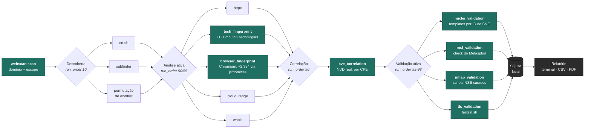
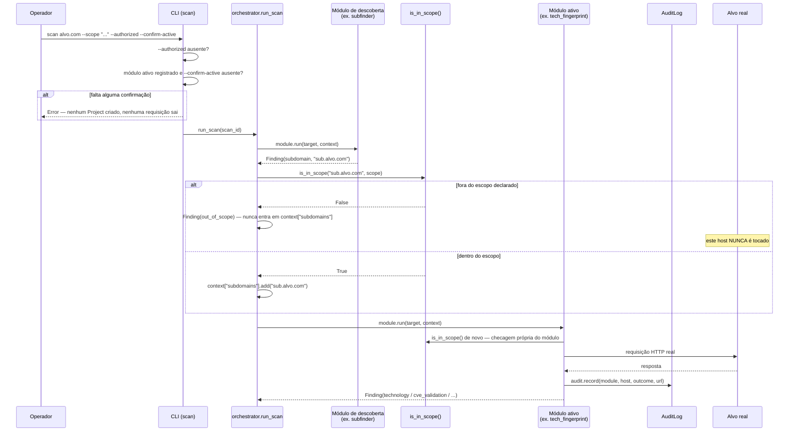

<div align="center">

# Web Application Reconnaissance &amp; Investigation Platform

### Aponte para um domínio. Receba a tecnologia exata, a versão exata, e CVEs reais.

Uma CLI ofensiva de reconhecimento que mapeia a superfície de ataque de um
alvo autorizado — descoberta de subdomínios, fingerprint ativo de
tecnologias e correlação de vulnerabilidades contra a NVD real — tudo em
um único processo síncrono, sem servidor, sem fila, sem infraestrutura
para manter no ar.

[](https://www.python.org/)
[](#referência-de-comandos)
[](#testes)
[](#correlação-de-cve)
[](LICENSE)
[](#autorização-e-uso-responsável)

<br>

[Visão geral](#o-que-a-ferramenta-faz) ·
[Veja em ação](#veja-em-ação) ·
[Tutorial](#tutorial-do-zero-ao-primeiro-scan) ·
[Comandos](#referência-de-comandos) ·
[Arquitetura](#como-funciona-por-dentro) ·
[Roadmap](#roadmap)

</div>

<br>

> [!IMPORTANT]
> Esta é uma ferramenta ofensiva. Ela envia requisições reais contra
> qualquer alvo que você fornecer — descoberta de subdomínios, sondagem
> HTTP direta, resolução DNS. **Use apenas contra sistemas que você
> possui ou tem autorização explícita e documentada para testar** (um
> pentest contratado, um bug bounty com escopo definido, seus próprios
> sistemas, ou domínios públicos de teste como `example.com`).

---

## Sumário

<details open>
<summary><strong>Clique para recolher/expandir</strong></summary>

| | | |
|---|---|---|
| [O que a ferramenta faz](#o-que-a-ferramenta-faz) | [Por que não só usar nuclei + subfinder na mão?](#por-que-não-só-usar-nuclei--subfinder--msfconsole-na-mão) | [Veja em ação](#veja-em-ação) |
| [Tutorial: do zero ao primeiro scan](#tutorial-do-zero-ao-primeiro-scan) | [Modo interativo (shell)](#modo-interativo-shell) | [Problemas comuns](#problemas-comuns) |
| [Referência de comandos](#referência-de-comandos) | [Autorização e uso responsável](#autorização-e-uso-responsável) | [Como funciona por dentro](#como-funciona-por-dentro) |
| [Catálogo de módulos](#catálogo-de-módulos) | [Fingerprint de tecnologias](#fingerprint-de-tecnologias) | [Correlação de CVE](#correlação-de-cve) |
| [Configuração](#configuração) | [Dados e persistência](#dados-e-persistência) | [Trilha de auditoria](#trilha-de-auditoria) |
| [Testes](#testes) | [Limitações conhecidas](#limitações-conhecidas) | [Roadmap](#roadmap) |

</details>

---

## Por que não só usar nuclei + subfinder + msfconsole na mão?

Dá, claro — e essa ferramenta literalmente usa essas mesmas ferramentas
por baixo. A diferença não é "fazer algo que elas não fazem", é
**orquestrar as sete/oito ferramentas certas na ordem certa, com o
contexto de uma passando pra próxima**, e persistir tudo de um jeito
que dá pra auditar depois — o que na prática ninguém mantém rodando na
mão scan após scan.

| | Rodando cada ferramenta na mão | Esta plataforma |
|---|---|---|
| Descobrir subdomínios | `subfinder -d alvo.com` num terminal, copiar a lista | Automático, já filtrado por escopo |
| Saber a **versão exata** da tecnologia | Ler HTML/headers manualmente por host | Motor Wappalyzer completo (HTTP + navegador headless), 100% do dataset |
| Achar CVEs pra essa versão | Buscar uma por uma no NVD, comparar CPE à mão | Correlação automática por faixa de CPE, todas as tecnologias |
| Confirmar se a CVE é real, não só "a versão bate" | Rodar `nuclei -id CVE-X` uma CVE de cada vez, depois tentar de novo com Metasploit, depois lembrar de testar TLS separado | **4 motores** (`nuclei`, Metasploit, `nmap`, `testssl.sh`) rodam automaticamente, por CVE, com circuit breaker e sem repetir trabalho |
| Não perder o controle do que foi tocado | Sem registro nenhum, ou um bloco de notas | Toda requisição de rede vira uma linha auditável (`webscan audit`) |
| Reimprimir um resultado antigo sem escanear de novo | Torcer pra ter salvo o output do terminal | `webscan report <id>` — vem do banco, zero requisições novas |
| Exportar pra um cliente/relatório | Copiar e formatar manualmente | PDF/CSV prontos, CVEs ordenadas por CVSS+EPSS |

E o oposto também importa: esta ferramenta **não tenta reinventar**
`nuclei`, Metasploit, `nmap` ou `testssl.sh` — ela os invoca do jeito
certo, com os limites de segurança certos (`dos`/`fuzz`/`intrusive`
sempre excluídos, escopo sempre verificado antes de qualquer requisição,
`--authorized`/`--confirm-active` obrigatórios), e persiste o resultado
de um jeito que sobrevive ao fechamento do terminal.

### E contra ferramentas comerciais?

Comparação honesta — esta ferramenta **não** substitui um scanner
enterprise de gestão de vulnerabilidade nem um proxy de teste manual.
O que ela é: um orquestrador gratuito, de código aberto, CLI-first, pra
quem já usa `nuclei`/Metasploit/`nmap`/`testssl.sh` separadamente e
quer o fluxo completo — descoberta → fingerprint → correlação → 4
confirmações ativas — automatizado, auditável e sem licença.

| | Esta ferramenta | Burp Suite Pro | Nessus / Tenable | Qualys VMDR |
|---|:---:|:---:|:---:|:---:|
| Preço | **Grátis** (MIT) | ~US$449/ano por usuário | ~US$3.000+/ano | Cotação, tipicamente enterprise |
| Infraestrutura | Um processo, SQLite local | App desktop | Scanner dedicado (VM/appliance) | SaaS gerenciado |
| Correlação de CVE por CPE contra a NVD real | ✅ | Não é o foco | ✅ (banco próprio) | ✅ (banco próprio) |
| Confirmação ativa multi-motor por CVE | ✅ 4 motores independentes | Scanner ativo próprio | Plugins próprios | Plugins próprios |
| Fingerprint via navegador headless | ✅ (Chromium) | ✅ (é o próprio proxy) | Limitado | Limitado |
| Trilha de auditoria por requisição de rede | ✅ | Parcial (histórico do proxy) | ✅ | ✅ |
| Teste manual interativo (interceptar/repetir requisição) | ❌ — não é o foco | ✅ — é o foco | ❌ | ❌ |
| Gestão de ativos/compliance em escala corporativa | ❌ | ❌ | Parcial | ✅ — é o foco |
| Código aberto, auditável | ✅ | ❌ | ❌ | ❌ |

Se o seu trabalho é interceptar e manipular requisição por requisição à
mão, você quer o Burp. Se é gerenciar milhares de ativos com relatório
de compliance pra auditoria, você quer Nessus/Qualys. Se é automatizar
"descobri um alvo, quero saber a stack exata e quais CVEs reais batem,
confirmadas por mais de uma ferramenta, sem clicar em nada" — é pra
isso que esta ferramenta existe.

## Veja em ação

Saída real de um scan de verdade (`webscan scan artssystem.com.br
--scope "..." --authorized --confirm-active`, sem edição — só
resumida pra caber aqui):

```text
$ webscan scan artssystem.com.br --scope "pentest autorizado" --authorized --confirm-active
Running crtsh...
Running subfinder...
Running subdomain_permutation...
Running cloud_range...
Running httpx_probe...
Running tech_fingerprint...
Running whois...
Running browser_fingerprint...
Running cve_correlation...
Running nuclei_validation...
Running msf_validation...
Running nmap_validation...
Running tls_validation...

Scan #22 - status: complete
                                    Technologies
┌──────────────────────┬──────────────┬─────────┬────────────┬────────────────────┐
│ Category              │ Name         │ Version │ Confidence │ Host                │
├──────────────────────┼──────────────┼─────────┼────────────┼────────────────────┤
│ web_servers           │ Nginx        │ 1.24.0  │ high       │ artssystem.com.br   │
│ programming_languages │ PHP          │ 8.3.0   │ high       │ central.artssyst... │
│ javascript_libraries  │ jQuery       │ 3.6.0   │ high       │ central.artssyst... │
│ javascript_libraries  │ jQuery UI    │ 1.13.2  │ high       │ central.artssyst... │
│ ui_frameworks         │ Bootstrap    │ 5.3.3   │ high       │ artssystem.com.br   │
│ font_scripts          │ Font Awesome │ 5.10.0  │ high       │ artssystem.com.br   │
│ ... +42 mais                                                                     │
└──────────────────────┴──────────────┴─────────┴────────────┴────────────────────┘

Nenhuma CVE correlacionada nesse scan — as 48 tecnologias detectadas,
nessas versões exatas, não têm entrada correspondente na base de CPE da
NVD no momento do scan. Sem tabela de CVEs pra mostrar, e é isso mesmo:
ver "zero" quando é zero de verdade é o comportamento certo.
```

**Números desse scan, do início ao fim, sem edição:** 48 tecnologias
detectadas em 3 hosts confirmados vivos (Nginx, PHP 8.3.0, jQuery
3.6.0, Bootstrap 5.3.x, Font Awesome, entre outras), 0 CVEs
correlacionadas, todos os 4 motores de validação ativa rodaram até o
fim sem circuit breaker disparar (não havia nada suspeito pra validar).
Veja [Correlação de CVE](#correlação-de-cve) pra entender cada coluna —
inclusive a diferença entre a lógica de correlação atual e a de
versões anteriores, que gerava falsos positivos nesse mesmo alvo.

---

## O que a ferramenta faz

Você fornece um domínio. A ferramenta:

**1. Descobre** subdomínios — certificate transparency, enumeração
passiva agregada, permutação de wordlist sobre o que já foi encontrado.

**2. Sonda ativamente** o alvo e cada subdomínio contra um motor de
fingerprint orientado por dados — **7.586 tecnologias**, 100% do dataset
vendorizado do Wappalyzer — extraindo a **versão exata** sempre que ela
vaza por headers, cookies, tags `generator`, arquivos de
changelog/manifest expostos, ou (via um Chromium headless opcional)
variáveis JavaScript globais, seletores DOM e regras de stylesheet — as
checagens que uma requisição HTTP crua estruturalmente não alcança.

**3. Correlaciona** cada tecnologia com versão conhecida contra a API
real da NVD, filtrando por faixa de CPE — não é busca textual solta, é
verificação estrutural de que aquela versão específica realmente cai
dentro da faixa vulnerável da CVE.

**4. Valida ativamente** um subconjunto das CVEs correlacionadas com
**quatro motores independentes** — templates comunitários do `nuclei`,
a ação `check` do Metasploit Framework, scripts NSE curados do `nmap`,
e checagens de protocolo TLS/SSL via `testssl.sh` — promovendo o status
de `suspected` para `confirmed` assim que qualquer um deles reproduz a
exploração de forma segura.

**5. Imprime um relatório** no terminal, agrupado por Tecnologias, CVEs
(ordenadas por CVSS decrescente, severidade colorida) e outros achados —
e grava tudo em um banco SQLite local para você revisitar depois.

Sem frontend, sem API HTTP, sem Celery, sem Redis, sem Docker.
**Um comando, um processo, um relatório.**



---

## Tutorial: do zero ao primeiro scan

Este tutorial assume que você **nunca rodou a ferramenta antes**. Siga
na ordem — cada passo tem uma forma de confirmar que funcionou antes de
seguir pro próximo. Se algo não bater com o descrito, vá direto para
[Problemas comuns](#problemas-comuns).

Escolha sua plataforma: [Windows (PowerShell)](#passo-0--abra-o-terminal-certo)
é o mais detalhado, já que é onde mais gente trava; macOS/Linux acompanha
em cada passo.

### Atalho: um comando só, depois de clonar

Se você já tem Python e (opcionalmente) Go instalados, os scripts
`start.ps1` (Windows) e `start.sh` (macOS/Linux/WSL) na raiz do
repositório fazem os Passos 2 a 6 por você: criam o `venv`, instalam o
pacote, checam quais ferramentas externas estão faltando (via
`webscan doctor`), oferecem instalar as que faltarem, e já abrem o
[shell interativo](#modo-interativo-shell) no final.

```powershell
# Windows (PowerShell), de dentro da pasta do repositório
.\start.ps1
```

```bash
# macOS/Linux/WSL, de dentro da pasta do repositório
./start.sh
```

Pode rodar de novo a qualquer momento — cada passo é idempotente (não
reinstala o que já está instalado). Internamente o script muda para
`backend/` antes de ativar o `venv` e chamar `webscan` — importante
porque o banco SQLite da ferramenta (`dev.db`) usa caminho relativo ao
diretório atual, então tudo que passa por esse atalho lê/escreve
sempre o mesmo banco em `backend/dev.db`, o mesmo que o tutorial manual
abaixo usa. Se preferir entender cada passo manualmente (ou algo no
atalho não funcionar no seu ambiente), siga o tutorial completo abaixo.

### Passo 0 — Abra o terminal certo

**Windows:** abra o **PowerShell** (não o "Prompt de Comando"/`cmd`).
Menu Iniciar → digite `PowerShell` → Enter.

**macOS/Linux:** abra o Terminal normal.

### Passo 1 — Confirme que o Python está instalado (versão 3.13 ou mais recente)

```powershell
python --version
```

Resultado esperado: algo como `Python 3.13.12`. Se aparecer
**`'python' não é reconhecido como um comando`**, tente:

```powershell
py --version
```

Se nenhum dos dois funcionar, você não tem Python instalado — baixe em
[python.org/downloads](https://www.python.org/downloads/) (marque a
caixa **"Add Python to PATH"** durante a instalação — este é o passo que
mais gente esquece) e repita este passo.

> Daqui em diante este tutorial usa `python`. Se só `py` funcionou na sua
> máquina, troque `python` por `py` em todos os comandos abaixo.

### Passo 2 — Baixe o código

```powershell
git clone https://github.com/excanear/Web-Application-Reconnaissance-Investigation-Platform.git
```

Se você não tem `git` instalado, baixe o ZIP direto pelo botão verde
**"Code" → "Download ZIP"** na página do repositório no GitHub, e
extraia a pasta.

### Passo 3 — Entre na pasta certa

Este é o passo onde **quase todo mundo trava**: os comandos da
ferramenta só funcionam de dentro da pasta `backend/`, não da raiz do
projeto.

```powershell
cd Web-Application-Reconnaissance-Investigation-Platform\backend
```

**Confirme que está no lugar certo antes de continuar:**

```powershell
dir
```

Você precisa ver `app`, `tests`, `requirements.txt` na listagem. Se não
aparecer, você está na pasta errada — ajuste o `cd`.

*(macOS/Linux: mesma ideia, só troque `dir` por `ls` e `\` por `/` no
caminho.)*

### Passo 4 — Crie um ambiente virtual e instale as dependências

Um ambiente virtual (`venv`) isola os pacotes desta ferramenta do resto
do seu sistema — evita conflito de versões e, em Linux/macOS recentes, é
**obrigatório** (o Python do sistema recusa instalar pacotes
diretamente; veja
[`externally-managed-environment`](#erro-externally-managed-environment)
em Problemas comuns se você pular este passo e cair nesse erro).

```powershell
# Windows (PowerShell)
python -m venv venv
.\venv\Scripts\Activate.ps1
pip install -r requirements.txt
```

```bash
# macOS/Linux
python3 -m venv venv
source venv/bin/activate
pip install -r requirements.txt
```

**Como saber que o ambiente virtual está ativo:** o início da linha do
terminal passa a mostrar `(venv)` antes do resto do prompt. Enquanto
`(venv)` estiver lá, `python` e `pip` apontam para o ambiente isolado —
é assim que deve aparecer toda vez que você usar a ferramenta (se fechar
o terminal, é só repetir o passo de ativação:
`.\venv\Scripts\Activate.ps1` ou `source venv/bin/activate` — não
precisa recriar o venv).

Isso baixa e instala: `sqlalchemy`, `typer`, `rich`, `requests`,
`python-whois`, `python-dotenv`, `reportlab`, `pytest`. Leva menos de um
minuto.

**Como saber que funcionou:** a última linha no terminal deve ser algo
como `Successfully installed ...` listando os pacotes.

Em seguida, instale a própria ferramenta em modo editável, o que
registra o comando `webscan` no `venv`:

```powershell
pip install -e .
```

Com `(venv)` ativo, `webscan` passa a existir como comando direto —
não precisa mais digitar `python -m app.cli` (mas isso continua
funcionando, se preferir).

### Passo 5 — Rode seu primeiro scan

Agora o comando principal da ferramenta. Vamos usar `example.com`, o
domínio de exemplo reservado pela IANA, seguro para qualquer um testar:

```powershell
webscan scan example.com --scope "meu primeiro teste" --authorized --confirm-active
```

**O que esperar na tela**, em ordem:

```text
Running crtsh...
Running subfinder...
Running subdomain_permutation...
Running cloud_range...
Running httpx_probe...
Running tech_fingerprint...
Running whois...
Running cve_correlation...
```

Isso leva de 10 a 40 segundos (a ferramenta está fazendo requisições de
rede de verdade — não travou, isso é o `cve_correlation` respeitando o
limite de taxa da API da NVD). No fim, o relatório aparece em tabelas.

**Se você chegou até aqui e viu o relatório final — funcionou.**
Parabéns, a ferramenta está instalada e operando.

### Passo 6 — Rode contra o seu próprio alvo

Troque `example.com` pelo domínio que você está autorizado a testar, e
`"meu primeiro teste"` por uma descrição de escopo real:

```powershell
webscan scan seudominio.com --scope "pentest autorizado - contrato XYZ" --authorized --confirm-active
```

Depois, veja tudo que você já rodou:

```powershell
webscan history
```

E reimprima o relatório de um scan específico (troque `1` pelo número
da coluna `ID` do `history`):

```powershell
webscan report 1
```

### Modo interativo (shell)

Rodar `webscan` sozinho, sem nenhum subcomando, abre um shell
interativo — parecido com entrar numa ferramenta como o `claude`. Você
digita os comandos sem repetir `webscan` toda vez, e sai com `exit`,
`quit` ou Ctrl+D:

```text
$ webscan
webscan interactive shell. Type a command (e.g. 'history'), 'help' for options, or 'exit' to quit.
webscan> history
...
webscan> scan example.com --scope "meu primeiro teste" --authorized --confirm-active
...
webscan> report 1
...
webscan> exit
```

Dentro do shell, `help` (ou `?`) lista os comandos disponíveis, e um
comando com erro (opção inválida, comando inexistente, scan sem
`--authorized` etc.) mostra a mensagem de erro e volta pro prompt — não
derruba a sessão. Ctrl+C cancela a linha atual sem fechar o shell.

---

## Problemas comuns

<details>
<summary><strong>Rodei um scan e o histórico/resultados parecem ter sumido, ou ferramentas que eu sei que estão instaladas aparecem como faltando</strong></summary>
<br>

O banco SQLite (`dev.db`) da ferramenta usa caminho relativo ao
diretório atual — se você rodar `webscan` de uma pasta diferente da
que usou da última vez (por exemplo, uma vez de dentro de `backend/` e
outra vez da raiz do repositório), cada uma cria/lê um `dev.db`
**diferente**, com histórico e IDs de scan próprios (você pode ver
"Scan #2" mesmo já tendo rodado dezenas de scans antes, se for a
segunda vez rodando naquela pasta específica). `webscan doctor`
também reflete o `PATH` do processo que o rodou — sinais de ferramenta
faltando reaparecem "do zero" nesse cenário mesmo já tendo instalado
tudo antes numa pasta ou terminal diferente.

Confirme sempre rodando `webscan` **de dentro de `backend/`** (veja o
[Passo 3](#passo-3--entre-na-pasta-certa)) — é onde `dev.db` deveria
morar e é o que o resto deste tutorial assume. Os scripts
`start.ps1`/`start.sh` já fazem essa mudança de diretório
automaticamente antes de chamar `webscan`.

</details>

<details>
<summary><strong><code>ModuleNotFoundError: No module named 'app'</code></strong></summary>
<br>

Você rodou o comando de fora da pasta `backend/`. Volte ao
[Passo 3](#passo-3--entre-na-pasta-certa): rode `cd backend` (ajuste o
caminho pra onde você está) e confirme com `dir`/`ls` que `app`,
`tests`, `requirements.txt` aparecem antes de tentar de novo.

</details>

<details>
<summary><strong><code>'python' não é reconhecido como um comando</code></strong></summary>
<br>

Duas causas possíveis:
1. Python não está instalado — instale em
   [python.org/downloads](https://www.python.org/downloads/), marcando
   **"Add Python to PATH"**.
2. Python está instalado mas só responde a `py` — troque `python` por
   `py` em todos os comandos.

</details>

<details>
<summary><strong>PowerShell se recusa a rodar um script <code>.ps1</code></strong></summary>
<br>

Se você tentar rodar `.\scripts\install.ps1` (o script opcional dos
módulos `subfinder`/`httpx`, veja
[Referência de comandos](#instalar-subfinder-e-httpx-opcional)) e vir:

```text
não pode ser carregado porque a execução de scripts foi desabilitada neste sistema
```

Rode isto uma vez (permite scripts baixados só pro seu usuário, não muda
mais nada no sistema):

```powershell
Set-ExecutionPolicy -Scope CurrentUser RemoteSigned
```

Confirme com `S` quando perguntado, e tente rodar o script de novo.

</details>

<details>
<summary><strong>Erro dizendo que <code>--authorized</code> ou <code>--confirm-active</code> está faltando</strong></summary>
<br>

**Isso não é um bug — é a trava de segurança da ferramenta funcionando
como deveria.** Ela recusa criar um scan sem essas duas confirmações
explícitas (veja [Autorização e uso responsável](#autorização-e-uso-responsável)).
Adicione as duas flags no fim do comando:

```powershell
webscan scan example.com --scope "teste" --authorized --confirm-active
```

</details>

<details>
<summary><strong>O comando parece travado, não imprime nada por um tempo</strong></summary>
<br>

Normal nos primeiros 10-40 segundos — a ferramenta está mesmo fazendo
requisições de rede ao vivo (DNS, HTTP, consultas à NVD). Se passar de
uns 2 minutos sem nenhuma linha nova, pode ser um alvo com muitos
subdomínios ou rede lenta; espere mais um pouco antes de interromper com
`Ctrl+C`.

</details>

<details>
<summary><strong>Erro <code>externally-managed-environment</code></strong></summary>
<br>

```text
error: externally-managed-environment

× This environment is externally managed
╰─> To install Python packages system-wide, try apt install
    python3-xyz, where xyz is the package you are trying to
    install...
```

Isso acontece quando você tenta `pip install` **fora** de um ambiente
virtual, num Python instalado pelo gerenciador de pacotes do sistema
(comum em Ubuntu/Debian recentes e em Python instalado via Homebrew no
macOS). O Python recusa instalar pacotes diretamente no sistema pra não
quebrar outras ferramentas que dependem dele.

**A correção é o [Passo 4](#passo-4--crie-um-ambiente-virtual-e-instale-as-dependências):**
crie e ative um ambiente virtual antes de rodar `pip install`:

```bash
python3 -m venv venv
source venv/bin/activate
pip install -r requirements.txt
```

Confirme que `(venv)` apareceu no início da linha do terminal antes de
instalar — é isso que indica que o ambiente virtual está ativo e o
`pip install` vai parar de reclamar.

> Existe uma forma de forçar a instalação sem ambiente virtual
> (`pip install --break-system-packages -r requirements.txt`), mas ela
> tem esse nome por um motivo — pode quebrar outras ferramentas Python
> no seu sistema. Use o ambiente virtual; leva 10 segundos a mais e
> evita esse risco.

</details>

<details>
<summary><strong>Erro de permissão ao instalar dependências</strong></summary>
<br>

Se o `pip install` falhar por permissão mesmo dentro de um ambiente
virtual ativado (raro, mas acontece se o próprio `venv` foi criado numa
pasta sem permissão de escrita), apague a pasta `venv` e recrie em algum
lugar onde seu usuário tem permissão total — por exemplo, dentro da sua
pasta pessoal (`Documentos`, `home`), não em pastas do sistema.

</details>

<details>
<summary><strong><code>'pip' não é reconhecido como um comando</code></strong></summary>
<br>

Com o ambiente virtual ativado (passo 4), isso não deveria acontecer. Se
acontecer mesmo assim, troque `pip install` por `python -m pip install`
(ou `python3 -m pip install` no macOS/Linux).

</details>

<details>
<summary><strong><code>module_error</code> para <code>subfinder</code> ou <code>httpx_probe</code> no relatório</strong></summary>
<br>

Esperado se você não instalou as ferramentas Go externas — elas são
opcionais. O resto do scan continua funcionando normalmente (`crtsh`,
`whois`, `tech_fingerprint`, `cve_correlation` são Python puro, não
dependem delas). Se quiser instalá-las mesmo assim, veja
[Referência de comandos](#instalar-subfinder-e-httpx-opcional).

</details>

<details>
<summary><strong><code>sqlite3.OperationalError: database is locked</code> ou erro ao apagar o <code>dev.db</code></strong></summary>
<br>

Outra instância da ferramenta ainda está rodando (ou travada) segurando
o arquivo `dev.db`. Feche qualquer terminal onde a ferramenta esteja
rodando e tente de novo. No Windows, se persistir, reinicie o terminal.

</details>

<details>
<summary><strong>Nada disso resolveu</strong></summary>
<br>

Abra uma [issue no repositório](https://github.com/excanear/Web-Application-Reconnaissance-Investigation-Platform/issues)
com: o comando exato que você rodou, a mensagem de erro completa, e o
resultado de `python --version`.

</details>

---

## Referência de comandos

### Linux: instalar tudo de uma vez (recomendado)

Se você está no Linux, esse é o jeito mais rápido de ter a ferramenta
100% funcional — todas as ferramentas opcionais abaixo (`subfinder`,
`httpx`, `nuclei`, Chromium do Playwright, Metasploit Framework, `nmap`,
`testssl.sh`) de uma vez só, num único script idempotente (rodar de
novo só pula o que já está instalado):

```bash
# de dentro de backend/, com o venv ativado
./scripts/install_all_linux.sh
```

Ele instala Go via `apt` se faltar, compila `subfinder`/`httpx`/`nuclei`
via `go install`, instala o pacote Python da ferramenta
(`pip install -e .`), baixa o Chromium do Playwright com as bibliotecas
de sistema (`playwright install --with-deps`), instala o Metasploit
Framework pelo instalador oficial da Rapid7, o `nmap` via `apt`, e o
`testssl.sh` via `git clone` — pedindo sua senha de `sudo` quando
precisar (só pros passos que mexem em pacotes do sistema ou
`/usr/local/bin`). Tudo real e testado de ponta a ponta contra um
Ubuntu limpo: Go/build-essential/libpcap-dev via `apt`, os três
binários Go, Chromium rodando um scan de verdade, o Metasploit
confirmando/descartando CVEs reais via `search cve:` + `check`, e os
quatro motores de validação ativa rodando juntos num scan real completo.

No fim ele imprime um resumo do que ficou instalado. Se preferir
instalar cada ferramenta manualmente (ou não estiver no Linux), siga as
seções abaixo.

### Windows: instalar tudo de uma vez (recomendado)

Equivalente ao script acima, mas para Windows nativo: `subfinder`,
`httpx`, `nuclei` (via `go install`), o pacote Python da ferramenta, o
Chromium do Playwright, e `nmap` (via `winget`, se disponível).

```powershell
# de dentro de backend/, com o venv ativado
.\scripts\install_all_windows.ps1
```

O Metasploit Framework e o `testssl.sh` **não têm um caminho de
instalação nativa no Windows que valha a pena** (o instalador do
Metasploit para Windows está descontinuado/sem manutenção upstream, e
`testssl.sh` é um script bash) — para esses dois, rode
`scripts/install_all_linux.sh` dentro do WSL.

Depois de instalar (por aqui ou manualmente), rode `webscan doctor`
para confirmar o que a ferramenta está realmente enxergando — veja a
próxima seção.

### Verificar o que está instalado: `webscan doctor`

```powershell
webscan doctor
```

Imprime uma tabela com cada ferramenta externa que os módulos podem
usar (`subfinder`, `httpx`, `nuclei`, `msfconsole`, `nmap`,
`testssl.sh`), se foi encontrada, e o caminho do binário (ou o motivo
do problema). Sai com código de saída `1` se alguma estiver faltando ou
incorretamente identificada — útil em scripts.

Um caso real que esse comando existe para pegar: em algumas máquinas
Windows, o comando `httpx` no `PATH` **não é** o `httpx` do
ProjectDiscovery (usado para checar hosts vivos) — é a CLI de um pacote
Python chamado `httpx` (biblioteca cliente HTTP), que por coincidência
tem o mesmo nome de comando. Quando isso acontece, o módulo
`httpx_probe` roda a ferramenta errada, que falha imediatamente — zero
hosts vivos confirmados, e por consequência bem menos tecnologias e
CVEs no relatório final, sem nenhum erro óbvio na tela (só um
`module_error` enterrado nos achados). `webscan doctor` (e o próprio
`httpx_probe`, que agora detecta e recusa esse binário errado
automaticamente) existe justamente para pegar isso antes que o scan
rode e o resultado pareça "misteriosamente" menor do que deveria.

### Instalar `subfinder` e `httpx` (opcional)

Ferramentas Go externas, usadas pelos módulos de mesmo nome. Exigem
[Go](https://go.dev/dl/) instalado. Sem elas, esses dois módulos
específicos registram `module_error` e o resto do scan continua
normalmente — instalá-las não é obrigatório para usar a ferramenta.

```powershell
# Windows (de dentro de backend/)
.\scripts\install.ps1
```

```bash
# Linux/macOS (de dentro de backend/)
./scripts/install.sh
```

### Instalar `nuclei` (opcional, necessário para validação de CVE)

`nuclei_validation` confirma ativamente um subconjunto dos achados de
CVE `suspected` rodando templates comunitários do `nuclei` casados por
ID de CVE contra o alvo. Sem o `nuclei` instalado, esse módulo registra
um único achado `module_error` e toda CVE fica `suspected` — o resto do
scan não é afetado.

1. Instale o `nuclei`: https://github.com/projectdiscovery/nuclei#install-nuclei
2. Atualize sua biblioteca de templates (obrigatório — a ferramenta
   nunca vendoriza templates): `nuclei -update-templates`
3. Rode `nuclei -update-templates` periodicamente para pegar templates
   de CVEs recém-divulgadas.

> [!NOTE]
> A maioria das CVEs **não tem** template comunitário no `nuclei` — o
> `nuclei` cobre majoritariamente vulnerabilidades detectáveis via HTTP,
> não falhas de memória em binários, por exemplo. Quando isso acontece,
> o `nuclei` sai com código de erro 1 e a mensagem
> `no templates provided for scan` — esse é o comportamento **esperado**
> pra uma CVE sem template, não uma falha da checagem, e o
> `nuclei_validation` já trata isso como tal (não conta contra o
> circuit breaker). Validado ao vivo: das 164 CVEs suspeitas de um scan
> real, 158 não tinham template (`no_template`) e as 6 restantes
> rodaram de verdade (`no_match`) — todas as 164 foram tentadas, nenhuma
> travou o circuit breaker.

Toda invocação do `nuclei` exclui templates com tag `dos`, `fuzz` e
`intrusive` incondicionalmente — é um limite de segurança fixo no
código, não uma configuração.

### Instalar o Metasploit Framework (opcional, segundo validador ativo de CVE)

`msf_validation` é um segundo motor de confirmação ativa, independente
do `nuclei` — ele busca um módulo do Metasploit para a CVE
(`search cve:<id>`) e roda a ação `check` desse módulo contra o host,
que é a rotina não-destrutiva do próprio Metasploit para confirmar
vulnerabilidade sem explorar de fato. Sem o `msfconsole` instalado, esse
módulo registra um único achado `module_error` e a validação segue só
com o `nuclei` — nenhum dos dois módulos depende do outro.

1. Instale o Metasploit Framework:
   https://docs.metasploit.com/docs/using-metasploit/getting-started/nightly-installers.html
2. Confirme que `msfconsole` está no PATH: `msfconsole -v`

> [!NOTE]
> `msf_validation` só confirma CVEs cujo módulo do Metasploit expõe um
> serviço HTTP(S) na porta 443 — `RHOSTS`/`RPORT 443`/`SSL true` são os
> únicos parâmetros que esta ferramenta tem contexto pra preencher, já
> que ela só investiga ativos web. Um módulo que precise de outra
> porta/serviço (SMB, RDP, um datastore extra) reporta "inconclusive" em
> vez de uma falsa confirmação.

Como o `nuclei`, o Metasploit não é vendorizado — é uma instalação
separada do operador, e sua ausência nunca derruba o scan.

### Instalar `nmap` (opcional, terceiro validador ativo de CVE)

`nmap_validation` roda os próprios scripts NSE do `nmap` — não
templates de terceiros — pra um conjunto **curado e deliberadamente
pequeno** de CVEs bem conhecidas (Heartbleed, POODLE, e alguns outros
de HTTP): só os scripts cuja categoria (`categories` do próprio script,
verificado no `nmap` 7.98 vendorizado) inclui `safe` e exclui
`intrusive`/`exploit` — a mesma régua de segurança que o `nuclei` já
aplica excluindo tags `dos`/`fuzz`/`intrusive`. O `nmap` tem dezenas de
outros scripts CVE-específicos (Struts2, Drupal, PHP-CGI...) que exigem
disparar a falha de verdade pra confirmar — esses ficam de fora por
design, não por esquecimento.

1. Instale o `nmap`: https://nmap.org/download.html
2. Confirme que está no PATH: `nmap --version`

Sem o `nmap` instalado, esse módulo registra um único achado
`module_error` e a validação segue com os outros motores.

### Instalar `testssl.sh` (opcional, quarto validador ativo de CVE)

`tls_validation` cobre uma categoria que nenhum dos outros três motores
alcança: CVEs de protocolo TLS/SSL (Heartbleed, POODLE, DROWN, FREAK,
LOGJAM, CRIME, BREACH, SWEET32, BEAST, CCS injection), usando o
[testssl.sh](https://testssl.sh/) — cada checagem tem sua própria flag
dedicada (`--heartbleed`, `--poodle`, etc.), sem depender do scan
completo `-U`.

```bash
git clone --depth 1 https://github.com/drwetter/testssl.sh.git
sudo ln -s "$(pwd)/testssl.sh/testssl.sh" /usr/local/bin/testssl.sh
```

Sem o `testssl.sh` instalado, esse módulo registra um único achado
`module_error` e a validação segue com os outros três motores.

### Atualizar o dataset de fingerprint de tecnologias

`tech_fingerprint` detecta tecnologias usando uma cópia vendorizada do
dataset do [Wappalyzer](https://github.com/enthec/webappanalyzer)
(milhares de tecnologias, fork mantido pela comunidade do projeto
Wappalyzer original) mais um pequeno conjunto de sondas ativas próprias
do projeto (hoje só o `/CHANGELOG.txt` do WordPress, pra precisão de
versão além do que uma checagem passiva oferece).

O dataset vendorizado (`backend/app/data/technologies.json`,
`backend/app/data/categories.json`) vem junto com o repositório mas
fica desatualizado com o tempo. Atualize com:

```
webscan update-fingerprints
```

É uma operação de manutenção local — não toca em nenhum alvo, não
precisa de `--authorized`/`--confirm-active`, mesma postura do `nuclei
-update-templates`. Uma falha de rede deixa os arquivos vendorizados
existentes intocados.

`tech_fingerprint` cobre as checagens `headers`/`cookies`/`meta`/`html`/
`scriptSrc` — o que dá pra extrair de uma única resposta HTTP. As
checagens `js` (variável JavaScript global), `dom` (seletor de elemento,
atributo, texto ou propriedade) e `css` (regra de stylesheet) exigem uma
página de verdade renderizada — cerca de um terço das ~7.500 entradas do
dataset dependem só desses três tipos. O módulo `browser_fingerprint`
(veja abaixo) fecha essa lacuna rodando um Chromium headless via
Playwright; com o Chromium instalado, **100% das checagens do dataset
Wappalyzer vendorizado são avaliadas**, não só as compatíveis com HTTP
puro.

> [!NOTE]
> **Limitação conhecida:** tecnologias recém-detectadas cujo nome de
> exibição não bate com o nome de produto no CPE da NVD ainda não
> correlacionam CVE — gap conhecido, não é bug.

Os dados do Wappalyzer têm licença CC BY-SA 4.0 dos seus contribuidores;
a cópia vendorizada neste repositório é um espelho direto, sem
modificações, do fork mantido pela comunidade
([enthec/webappanalyzer](https://github.com/enthec/webappanalyzer)) —
que hoje soma **7.586 tecnologias**, buscadas 100% via
`webscan update-fingerprints` (todos os 27 shards `a.json`...`z.json` +
`_.json` do repositório, sem amostragem). O número "8.122" divulgado em
wappalyzer.com/technologies reflete adições feitas só na base comercial
fechada da Wappalyzer Inc. desde que o projeto saiu de código aberto em
2023 — não existe uma fonte pública equivalente a essas ~500 entradas
extras; o dataset vendorizado aqui já é o maior espelho aberto
disponível, e esta ferramenta consome 100% dele.

### Instalar o Chromium do Playwright (opcional, necessário para fingerprint via navegador)

`browser_fingerprint` roda as checagens `js`/`dom`/`css` do dataset
Wappalyzer que uma resposta HTTP crua não consegue satisfazer — ele
carrega cada host num Chromium headless real e lê variáveis JS globais,
seletores DOM (existência/texto/atributo/propriedade) e o texto das
folhas de estilo carregadas. Sem o Chromium instalado, esse módulo
registra um único achado `module_error` e o scan segue normalmente com
o restante do fingerprint feito por `tech_fingerprint`.

```bash
# Linux (inclui as bibliotecas de sistema necessárias, pede sudo uma vez)
playwright install --with-deps chromium
```

```powershell
# Windows/macOS (normalmente já tem as bibliotecas necessárias)
playwright install chromium
```

`is_active = True`: exige `--confirm-active`, mesma postura de
`tech_fingerprint`.

### Configurar uma chave de API da NVD (opcional, recomendado)

Sem uma chave, o limite de consulta à NVD é de 5 requisições a cada 30
segundos. Com uma chave gratuita, sobe para 50/30s — scans com muitas
tecnologias ficam bem mais rápidos.

```powershell
copy .env.example .env
```

Abra o `.env` num editor de texto e preencha `NVD_API_KEY=` com uma
chave gratuita obtida em
[nvd.nist.gov/developers/request-an-api-key](https://nvd.nist.gov/developers/request-an-api-key).
O `.env` nunca é commitado no git (já coberto pelo `.gitignore`).

### Idioma de saída

Por padrão a CLI imprime tudo em inglês. Para saída em português, use
`--lang pt` **antes** do nome do comando:

```bash
webscan --lang pt scan <alvo> --scope "<descrição do escopo autorizado>" --authorized --confirm-active
```

### Rodar um scan

```bash
webscan scan <alvo> --scope "<descrição do escopo autorizado>" --authorized --confirm-active
```

| Flag | Obrigatória | O que faz |
|---|---|---|
| `<alvo>` (argumento posicional) | sim | Domínio a mapear |
| `--scope` | sim | Descrição textual do escopo autorizado — salva no registro do projeto |
| `--authorized` | sim | Confirmação explícita de que você está autorizado a testar o alvo |
| `--confirm-active` | sim (se houver módulos ativos registrados) | Confirmação de que módulos que sondam o alvo diretamente podem rodar |
| `--name` | não | Nome do projeto (padrão: o próprio alvo) |
| `--max-requests-per-second` | não | Limita o ritmo de requisições contra o alvo/subdomínios (padrão `5.0`) |
| `--circuit-breaker-threshold` | não | Falhas consecutivas contra um alvo antes de um módulo parar de sondá-lo (padrão `5`) |
| `--max-workers` | não | Processa até essa quantidade de hosts em paralelo dentro de `tech_fingerprint`/`cloud_range` (padrão `1` — totalmente sequencial, idêntico a qualquer scan anterior a essa flag) |
| `--max-subdomains` | não | Teto de candidatos a subdomínio aceitos, somando `crtsh`+`subfinder`+`subdomain_permutation` juntos (padrão `1000`) |
| `--scope-include` | não | Padrão de domínio ou CIDR explicitamente dentro do escopo (repetível, padrão `<alvo>` e `*.<alvo>`) |
| `--scope-exclude` | não | Padrão de domínio ou CIDR explicitamente excluído (repetível) |
| `--scope-window` | não | Janela de horário UTC permitida, ex. `09:00-18:00` (padrão: sempre permitido) |

Omitir qualquer flag obrigatória interrompe a execução **antes** de
qualquer requisição atingir o alvo, com uma mensagem de erro explicando
o que falta.

`tech_fingerprint` e `cloud_range` pacificam cada host e param de sondar
um alvo que falha repetidamente, registrando um achado
`circuit_breaker_tripped` em vez de continuar às cegas. `httpx_probe`
repassa o mesmo ritmo pro próprio `-rate-limit` do `httpx`.
`cve_correlation` respeita o limite geral por cima do próprio pacing
específico da NVD. `crtsh` e `whois` fazem exatamente uma requisição por
scan, então nenhuma dessas travas se aplica a eles.

`--max-workers` só afeta `tech_fingerprint` e `cloud_range` — os dois
módulos com um loop por host em Python. O `httpx_probe` já paraleliza
internamente via o próprio `-rate-limit` do binário externo `httpx`; o
`cve_correlation` é limitado pelo próprio teto de requisições da API da
NVD, independente de paralelismo local, então continua sequencial.
Aumentar `--max-workers` **não** aumenta `--max-requests-per-second` —
só permite que essa quantidade de requisições em voo compartilhe o
mesmo orçamento de ritmo, em vez de uma requisição terminar
completamente antes da próxima começar, encurtando o tempo de parede em
escopos grandes sem enviar mais requisições por segundo. No padrão `1`,
os resultados (ordem dos achados, qual host dispara um trip do circuit
breaker, a contagem de `skipped_hosts`) são idênticos byte a byte a
antes dessa flag existir. Com `--max-workers` acima de `1`, essa
contabilidade continua totalmente determinística — só a ordem das
entradas do `webscan audit` para hosts processados no mesmo lote pode
variar entre execuções, nunca o conteúdo.

Módulos que sondam um host checam o escopo declarado primeiro — um host
fora de escopo que um módulo tocaria de outra forma é pulado e
registrado como achado `out_of_scope`. Se restringir o escopo com
`--scope-include` excluiria o próprio alvo, `scan` recusa criar o
projeto por completo.

`--max-subdomains` existe por um incidente real: uma fonte passiva do
`subfinder` (não o módulo `crtsh` próprio deste projeto) retornou
**24.739 "subdomínios"** para `example.com` em teste ao vivo — quase
todo ruído de histórico de certificate transparency (nomes como
`roberto163.example.com`, nunca infraestrutura real), não uma falha do
`subfinder` em si. Sem limite, cada um desses vira uma linha no banco
(um `INSERT`+`COMMIT` por achado) e é oferecido a todo módulo ativo
downstream (`cloud_range`, `httpx_probe`, `tech_fingerprint`,
`browser_fingerprint`) — o que derrubou um scan de verdade com erro de
I/O do SQLite. O teto é compartilhado entre `crtsh` + `subfinder` +
`subdomain_permutation` (o que vier primeiro na ordem de execução
preenche o teto primeiro); ao ser atingido, um único achado
`subdomain_discovery_capped` registra o limite usado e os candidatos
restantes são descartados sem sondar. Reproduzido com a captura real de
24.948 linhas do incidente: sem o teto, o scan travava; com ele, conclui
em segundos com exatamente 1.000 subdomínios persistidos.

**Hosts confirmados são sondados antes dos adivinhados por
permutação.** `cloud_range`, `tech_fingerprint` e `browser_fingerprint`
processam os hosts confirmados por descoberta real (`crtsh`,
`subfinder`) e o próprio alvo **antes** dos candidatos que só o
`subdomain_permutation` adivinhou — outro incidente real: como `-`
ordena antes de `.` em ASCII, um palpite tipo
`admin-amy.artssystem.com.br` ordenava alfabeticamente *antes* do
`amy.artssystem.com.br` de verdade de onde ele foi adivinhado. Um scan
real contra um alvo com 7 subdomínios confirmados vivos (via
`httpx_probe`) zerava tecnologias e CVEs porque o circuit breaker
esgotava nos primeiros 5 palpites `admin-*` inexistentes antes de
sequer tentar um host real. Corrigido: com a mesma priorização, o
mesmo alvo passou de **0 para 48 tecnologias e 164 CVEs correlacionadas**
no primeiro scan após a correção.

### Ver histórico

```bash
webscan history
```

Lista todo scan já rodado (id, projeto, alvo, status, data).

### Reimprimir um relatório

```bash
webscan report <scan_id>
```

Reimprime o relatório formatado de um scan já concluído, sem rodar nada
de novo — útil para revisitar um resultado sem gastar novas requisições
contra o alvo ou a NVD.

### Exportar um relatório

`webscan report <scan_id>` por padrão gera a tabela no terminal mostrada
acima. Dois formatos adicionais estão disponíveis:

- `webscan report <scan_id> --format csv` — uma linha por achado de CVE
  (`cve, severity, cvss, epss, status, technology, host, description,
  evidence, remediation`), escrita no stdout. Os nomes das colunas são
  fixos e em inglês independente de `--lang`, seguindo a mesma
  convenção do `webscan audit --format csv` — CSV é para
  máquinas/planilhas, não para o idioma de exibição da CLI.
- `webscan report <scan_id> --format pdf [--output CAMINHO]` — um PDF
  autocontido (resumo executivo, tecnologias detectadas e CVEs
  priorizadas por CVSS com EPSS como desempate), localizado conforme
  `--lang`. Sem `--output`/`-o`, o arquivo é gravado como
  `report_<scan_id>.pdf` no diretório atual. Gerar o PDF não exige
  instalação de ferramenta externa — `reportlab` é uma dependência
  Python pura já fixada no `requirements.txt`, diferente de
  `nuclei`/`subfinder`/`httpx`.

O score EPSS (probabilidade de exploração, da API pública gratuita da
FIRST.org) de cada CVE é buscado e gravado uma única vez, no momento do
scan, do mesmo jeito que os dados de NVD/DeepL já são — os comandos
`report`/export nunca tocam a rede. CVSS continua sendo o sinal
principal de prioridade; EPSS só desempata CVEs que já compartilham a
mesma nota CVSS.

A recomendação de remediação vem do próprio texto `remediation` do
template `nuclei` que confirmou, quando o status da CVE é `confirmed`;
caso contrário, uma mensagem genérica de "atualize para uma versão
corrigida" nomeia a tecnologia afetada sem chutar um número de versão
específico.

### Ver a trilha de auditoria

```bash
webscan audit <scan_id> --format table
webscan audit <scan_id> --format csv > audit.csv
```

Lista toda `AuditEntry` registrada de um scan — módulo, alvo, URL,
resultado, timestamp. `table` (padrão) segue o mesmo estilo Rich do
`report`; `csv` escreve no stdout via o módulo `csv` da stdlib (sem
flag `--output`). Veja [Trilha de auditoria](#trilha-de-auditoria) para
o que é registrado e por quê.

<details>
<summary><strong>Ver <code>--help</code> completo</strong></summary>

```text
$ webscan --help

Usage: webscan [OPTIONS] COMMAND [ARGS]...

 Recon & Investigation CLI

+- Options -------------------------------------------------------------------+
| --lang                      <str>  Output language: en (default) or pt      |
|                                    [default: en]                            |
+-----------------------------------------------------------------------------+
+- Commands ------------------------------------------------------------------+
| scan                                                                        |
| history                                                                     |
| update-fingerprints                                                         |
| report                                                                      |
| audit                                                                       |
+-----------------------------------------------------------------------------+
```

</details>

---

## Autorização e uso responsável

A ferramenta impõe duas travas técnicas, não só uma recomendação:

1. **`--authorized`** — obrigatória em todo `scan`. Sem essa flag,
   nenhum projeto é criado e nenhuma requisição sai da sua máquina.
2. **`--confirm-active`** — obrigatória sempre que um módulo está
   marcado como ativo no registro (`httpx_probe` e `tech_fingerprint`
   hoje — eles enviam requisições HTTP reais diretamente contra o alvo,
   diferente de módulos passivos como `crtsh` ou `whois`, que consultam
   serviços de terceiros).

Todo projeto grava seu `scope_notes` — a descrição de escopo que você
forneceu — junto com os resultados, então o histórico de scans carrega o
registro da autorização declarada.

**Camadas de segurança, de fora pra dentro** — nenhuma delas é
configurável pra "desligar", só pra ajustar o quão sensível é:

| Camada | O que impede |
|---|---|
| `--authorized` / `--confirm-active` | Nenhum projeto é criado, nenhum pacote sai da máquina, sem confirmação explícita |
| Escopo estruturado (`--scope-include`/`--scope-exclude`/`--scope-window`) | Um host fora do escopo declarado nunca é sondado, mesmo se descoberto — vira achado `out_of_scope` |
| Exclusão fixa de tags `dos`/`fuzz`/`intrusive` no `nuclei` | Nenhum template destrutivo/instável roda, incondicionalmente |
| Só scripts `nmap` categoria `safe` | `nmap_validation` nunca roda um script que precise disparar a falha de verdade pra confirmar |
| `check` do Metasploit, nunca `exploit` | `msf_validation` só roda a ação de confirmação não-destrutiva do próprio módulo |
| `--max-subdomains` | Uma fonte passiva ruidosa nunca inunda o scan nem o banco |
| Circuit breaker por módulo | Um alvo que falha repetidamente para de ser sondado às cegas |
| `--max-requests-per-second` | O ritmo de requisições contra o alvo é sempre limitado, nunca "o mais rápido possível" |

**O escopo é imposto em duas camadas independentes**, não só declarado
uma vez no início: o orquestrador filtra candidatos de subdomínio antes
de alimentar qualquer módulo ativo, e cada módulo ativo checa o escopo
de novo por conta própria antes de enviar uma requisição — defesa em
profundidade, não um único ponto de falha.



## Como funciona por dentro

```text
webscan scan → cria Project + Scan (SQLite)
           → orchestrator.run_scan(scan_id)
                → itera MODULE_REGISTRY ordenado por run_order
                     10  descoberta     (crtsh, subfinder, subdomain_permutation)
                     50  análise        (cloud_range, httpx_probe, tech_fingerprint, whois)
                     55  análise        (browser_fingerprint)
                     90  correlação     (cve_correlation)
                     95  validação      (nuclei_validation)
                     96  validação      (msf_validation)
                     97  validação      (nmap_validation)
                     98  validação      (tls_validation)
                → cada módulo recebe (target, context) e devolve Finding[]
                → context["subdomains"] e context["technologies"] acumulam
                  conforme os módulos rodam, alimentando os próximos
                → todo Finding é persistido, isolado por módulo — um
                  módulo quebrado vira um Finding module_error, o scan continua
           → a CLI imprime o relatório agrupado
```

O núcleo é um **registro de plugins**: cada módulo é uma classe Python
decorada com `@register_module`, com um atributo `run_order` (controla
quando roda) e `is_active` (controla se exige `--confirm-active`).
Adicionar um módulo novo não exige tocar no orquestrador — só criar o
arquivo e importá-lo em `app/modules/__init__.py`.

## Catálogo de módulos

| Módulo | `run_order` | Ativo? | O que faz |
|---|:---:|:---:|---|
| `crtsh` | 10 | — | Consulta logs públicos de certificate transparency (crt.sh) por subdomínios que apareceram em certificados SSL emitidos |
| `subfinder` | 10 | — | Agrega subdomínios de múltiplas fontes passivas via a ferramenta externa `subfinder` |
| `subdomain_permutation` | 10 | — | Gera candidatos combinando uma wordlist de nomes comuns (dev, staging, admin, api, vpn...) com subdomínios já descobertos |
| `cloud_range` | 50 | — | Resolve cada host via DNS e verifica se o IP cai dentro de uma faixa conhecida da AWS/GCP/Azure |
| `httpx_probe` | 50 | **sim** | Visita cada host candidato via HTTP real, confirma quais estão vivos, faz fingerprinting básico via `httpx -tech-detect` |
| `tech_fingerprint` | 50 | **sim** | Detecção de tecnologia orientada por Wappalyzer (checagens HTTP) com sondas de path ativas — veja a seção dedicada abaixo |
| `whois` | 50 | — | Consulta os dados reais de registro do domínio |
| `browser_fingerprint` | 55 | **sim** | Detecção de tecnologia via Chromium headless (Playwright) para as checagens `js`/`dom`/`css` do Wappalyzer que uma resposta HTTP não alcança |
| `cve_correlation` | 90 | — | Correlaciona cada tecnologia com versão conhecida contra a API real da NVD |
| `nuclei_validation` | 95 | **sim** | Roda templates `nuclei` casados por ID de CVE contra achados `suspected`, excluindo templates com tag `dos`/`fuzz`/`intrusive` |
| `msf_validation` | 96 | **sim** | Busca um módulo do Metasploit por CVE (`search cve:<id>`) e roda sua ação `check` contra o host — segundo motor de confirmação, independente do `nuclei` |
| `nmap_validation` | 97 | **sim** | Roda o script NSE próprio do `nmap` pra um conjunto curado de CVEs conhecidas (Heartbleed, POODLE, alguns HTTP) — só scripts com categoria `safe` |
| `tls_validation` | 98 | **sim** | Roda o `testssl.sh` pra CVEs de protocolo TLS/SSL (Heartbleed, POODLE, DROWN, FREAK, LOGJAM, CRIME, BREACH, SWEET32, BEAST, CCS injection) |

"Ativo" = envia requisições diretamente contra o alvo/subdomínios, além
de só consultar serviços de terceiros. Módulos ativos exigem
`--confirm-active`.

## Fingerprint de tecnologias

`tech_fingerprint` + `browser_fingerprint` juntos detectam tecnologias
usando uma cópia vendorizada do dataset do
[Wappalyzer](https://github.com/enthec/webappanalyzer) (7.586
tecnologias, mantido pela comunidade) mais sondas ativas próprias do
projeto — `tech_fingerprint` cobre as checagens `headers`/`cookies`/
`meta`/`html`/`scriptSrc` a partir de uma única resposta HTTP (5.252
tecnologias), `browser_fingerprint` cobre `js`/`dom`/`css` via Chromium
headless (as ~2.334 tecnologias restantes, que só se revelam depois que
o JavaScript da página roda de verdade). Veja
[Atualizar o dataset de fingerprint de tecnologias](#atualizar-o-dataset-de-fingerprint-de-tecnologias)
e [Instalar o Chromium do Playwright](#instalar-o-chromium-do-playwright-opcional-necessário-para-fingerprint-via-navegador)
acima para como manter os dois atualizados.

Fingerprint de banco de dados é deliberadamente limitado a sinais
indiretos (cookies, headers, mensagens de erro já expostas) — detecção
direta via técnicas de injeção é teste de vulnerabilidade, não
reconhecimento, e está fora do escopo desta ferramenta.

## Correlação de CVE

`cve_correlation` não faz busca por frase exata contra a NVD — essa
abordagem foi testada ao vivo e descartada porque retornava quase zero
resultados reais (a maioria das descrições de CVE não cita a versão
como texto literal). A abordagem real:

1. Busca por palavra-chave só no **nome** da tecnologia
   (`keywordSearch=nginx`).
2. Para cada CVE retornada, lê a lista `configurations` que a NVD anexa
   — as faixas de CPE (`versionStartIncluding`, `versionEndExcluding`,
   etc.) que definem quais versões estão realmente afetadas.
3. Só reporta a CVE se a versão detectada realmente cair dentro da faixa
   (ou bater exatamente com uma versão fixada no CPE, quando não há
   faixa).

Validado ao vivo: `nginx 1.18.0` retorna corretamente **46 CVEs reais**
contra a API de produção da NVD.

O passo 2 compara o nome da tecnologia contra o campo **product** do
CPE (não a string de criteria inteira, e não por substring) — as duas
versões anteriores dessa lógica geraram falsos positivos reais e já
corrigidos: primeiro casando contra o **vendor** do CPE (então
"Apache", nosso nome pro servidor web, batia com qualquer produto da
Apache Software Foundation — Log4j, Struts, etc.); depois, já
comparando o produto certo mas por **substring**, "Nginx" batia com
qualquer CPE cujo produto meramente contivesse "nginx" como pedaço do
nome — `nginx_proxy_manager`, `nginx-ui`, `nginx_ingress_controller`,
nenhum dos quais é o servidor web em si. Hoje exige igualdade exata do
campo produto (com um mapa pontual de alias pra casos como
`apache` → `http_server`). Efeito prático: um alvo real frequentemente
mostra **menos CVEs suspeitas** do que antes dessa correção — isso é o
esperado, não um regresso; os números antigos incluíam produtos errados.

A coluna **Status** de cada CVE no relatório mostra `suspected` ou
`confirmed`. `suspected` significa que a versão cai dentro da faixa de
CPE da CVE segundo a NVD — resultado só da correlação estrutural.
`confirmed` significa que **pelo menos um** dos quatro motores de
validação ativa reportou um resultado positivo contra o alvo,
confirmando que a vulnerabilidade pode realmente ser reproduzida via uma
checagem segura (sem exploração, só detecção):

- `nuclei_validation` — template comunitário `nuclei` casado por ID de CVE
- `msf_validation` — ação `check` de um módulo do Metasploit pra mesma CVE
- `nmap_validation` — script NSE próprio do `nmap`, conjunto curado de CVEs conhecidas
- `tls_validation` — checagem do `testssl.sh`, CVEs de protocolo TLS/SSL

Os quatro rodam de forma independente e aditiva, todos implementando o
mesmo contrato (`ActiveCveValidatorModule` em
`app/modules/cve_validator_base.py`, que trata do loop por CVE, filtro
de escopo e circuit breaker de forma idêntica pros quatro — só a lógica
específica de cada ferramenta muda). Se mais de um confirmar a mesma
CVE, o campo `validated_by` do achado lista todas as ferramentas
(`["nuclei", "metasploit"]`, por exemplo), e a coluna **Evidence** do
relatório junta a evidência de cada uma.

## Configuração

Variáveis de ambiente lidas de `backend/.env` (nunca commitado — já
coberto pelo `.gitignore`):

| Variável | Obrigatória | Padrão | Descrição |
|---|:---:|---|---|
| `DATABASE_URL` | não | `sqlite:///./dev.db` | String de conexão SQLAlchemy. SQLite local por padrão — funciona sem nenhum banco externo |
| `NVD_API_KEY` | não | (nenhuma) | Eleva o limite de requisições à NVD de 5/30s para 50/30s. Gratuita em nvd.nist.gov |
| `DEEPL_API_KEY` | não | (nenhuma) | Ativa a tradução para português das descrições de CVE da NVD. Nível gratuito em deepl.com. Sem ela, as descrições de CVE ficam só em inglês e o relatório marca a célula em português como indisponível quando `--lang pt` é usado |

## Dados e persistência

Quatro tabelas SQLite (`app/models.py`):

```text
Project(id, name, target, scope_notes, authorized, authorized_at, created_at)
Scan(id, project_id, status, started_at, finished_at)
Finding(id, scan_id, module, type, value, data:JSON, created_at)
AuditEntry(id, scan_id, module, target, url, outcome, requested_at)
```

`Finding.type` inclui hoje: `subdomain`, `whois`, `live_host`,
`technology`, `cve`, `cloud_asset`, `module_error`,
`circuit_breaker_tripped`, `out_of_scope`, `scope_window_closed`.
`Finding.data` guarda o payload específico do tipo (categoria/versão/
confiança para tecnologia; CVSS/severidade/descrição para CVE, etc).

## Trilha de auditoria

Toda requisição de rede real que a ferramenta faz — contra o alvo/
subdomínios e contra serviços de terceiros como a NVD — é registrada
como uma `AuditEntry`: módulo, alvo, URL (quando aplicável), resultado e
timestamp. Isso é separado do relatório de achados; existe para provar
o que a ferramenta realmente tocou, independente do que virou um
achado. `subfinder` e `httpx_probe` chamam binários Go externos e não
enxergam as requisições individuais que esses binários fazem
internamente, então recebem uma entrada por invocação/por host
respectivamente — uma aproximação aceita, não fidelidade literal por
socket.

```bash
webscan audit <scan_id> --format table
webscan audit <scan_id> --format csv > audit.csv
```

## Testes

```bash
cd backend
pytest -v
```

**330 testes**, cobrindo cada módulo isoladamente (mockando chamadas
externas, incluindo o Playwright do `browser_fingerprint`, o
`msfconsole` do `msf_validation`, o `nmap` do `nmap_validation` e o
`testssl.sh` do `tls_validation` — com fixtures baseadas em saída real
capturada dos quatro binários), a base compartilhada dos validadores
(`ActiveCveValidatorModule`), o orquestrador (isolamento de falha por
módulo, ordenação por `run_order`, propagação de contexto, acumulação
de `validated_by` quando mais de um validador confirma a mesma CVE,
achado `tool_missing` quando o preflight de ferramentas acusa
problema), a detecção de ferramentas (`app/tool_check.py` — resolve o
binário `httpx` correto mesmo com um executável de mesmo nome mas
errado no `PATH`, usando binários falsos reais gravados em disco pelo
teste, não só mocks), e a CLI (`typer.testing.CliRunner`, mockando o
orquestrador para não depender da rede).

## Limitações conhecidas

- **`subfinder`/`httpx` exigem instalação manual** de ferramentas Go
  externas — sem elas, esses dois módulos específicos ficam limitados
  (viram `module_error`, o resto do scan continua normal). O mesmo vale
  para o Chromium do Playwright (`browser_fingerprint`), o `nuclei`
  (`nuclei_validation`), o Metasploit (`msf_validation`), o `nmap`
  (`nmap_validation`) e o `testssl.sh` (`tls_validation`) — todos
  opcionais, nenhum derruba o scan quando ausente.
- **`nmap_validation` e `tls_validation` cobrem listas curadas e
  deliberadamente pequenas de CVEs conhecidas** — dezenas, não milhares
  como o `nuclei`. Uma CVE fora dessas listas simplesmente não é
  tentada por esses dois motores (`no_script`/`no_check` na auditoria,
  não é erro) — `nuclei_validation` e `msf_validation` continuam sendo
  os motores de cobertura ampla.
- **Sem cache de CVE** — toda consulta à NVD é uma chamada de rede nova,
  mesmo repetindo o mesmo alvo/tecnologia entre scans.
- **O comando `httpx` pode colidir com um pacote Python de mesmo nome**
  em algumas instalações Windows (um cliente HTTP genérico, não
  relacionado ao httpx do ProjectDiscovery que este projeto usa). A
  ferramenta detecta e recusa esse binário errado automaticamente
  (`app/tool_check.py`) e reporta o problema via `webscan doctor`/achado
  `tool_missing` em vez de rodar a ferramenta errada silenciosamente —
  mas se ambos aparecerem como "faltando", instale o real com
  `go install github.com/projectdiscovery/httpx/cmd/httpx@latest` e
  garanta que `$(go env GOPATH)/bin` vem antes da pasta `Scripts` do
  Python no `PATH`.
- **`subdomain_permutation` gera candidatos não confirmados** — eles
  aparecem como achado `subdomain` mesmo sem confirmação de que
  realmente respondem, a menos que o `httpx_probe` esteja instalado para
  filtrar o que está de fato vivo.
- **Alguns nomes de cookie usados como regex** no dataset do Wappalyzer
  (Drupal, ASP.NET, Joomla...) são checados literalmente — algumas
  entradas silenciosamente não disparam.
- **`browser_fingerprint` roda sequencialmente**, um host por vez dentro
  de uma única instância de Chromium — ao contrário de
  `tech_fingerprint`, ele ainda não usa `--max-workers` para paralelizar
  entre hosts.
- **`msf_validation` só cobre módulos HTTP(S) na porta 443** — ele
  preenche `RHOSTS`/`RPORT 443`/`SSL true` porque é o único contexto de
  serviço que esta ferramenta (focada em ativos web) já tem; um módulo
  do Metasploit para outro serviço (SMB, RDP, etc.) reporta
  "inconclusive" em vez de uma falsa confirmação.
- **8.122 vs. 7.586 tecnologias** — o número divulgado em
  wappalyzer.com/technologies inclui adições feitas só na base comercial
  fechada da Wappalyzer Inc. desde 2023; não existe fonte pública
  equivalente às ~500 entradas de diferença, e esta ferramenta já
  consome 100% do maior dataset aberto disponível
  ([enthec/webappanalyzer](https://github.com/enthec/webappanalyzer)).
- **`--max-subdomains` (padrão 1.000) é um corte cego, não um filtro de
  qualidade** — ele existe pra proteger o scan de ruído de fontes
  passivas (veja [Rodar um scan](#rodar-um-scan)), mas não distingue
  ruído de infraestrutura real: um alvo legítimo com mais de 1.000
  subdomínios reais tem o excedente descartado igual a um alvo ruidoso.
  Suba o teto com `--max-subdomains` se souber que o alvo tem uma
  superfície grande de verdade.

## Roadmap

Progresso do roadmap enterprise-grade — **10 de 10 fases concluídas**:

| Fase | Entrega | Status |
|:---:|---|:---:|
| A | Internacionalização (inglês primeiro, português selecionável) | ✅ |
| B | Rate limiting e circuit breaker configuráveis | ✅ |
| C | Escopo estruturado e imposto (não só declarado) | ✅ |
| D | Trilha de auditoria completa | ✅ |
| E | Validação ativa de vulnerabilidade via `nuclei` | ✅ |
| F | Relatório profissional + exportação PDF/CSV | ✅ |
| G | Cobertura de fingerprint ampliada (motor Wappalyzer, +7.500 tecnologias) | ✅ |
| H | Execução em escala — concorrência local controlada (`--max-workers`) | ✅ |
| I | Fingerprint via navegador (`browser_fingerprint`, 100% do dataset Wappalyzer) + segundo validador ativo de CVE (`msf_validation`, Metasploit) | ✅ |
| J | Terceiro e quarto validadores ativos de CVE (`nmap_validation`, `tls_validation`) + base compartilhada `ActiveCveValidatorModule` | ✅ |

**Próximos passos considerados** (sem fase formal ainda):

- Cache de resultado de CVE entre scans
- Fingerprint por hash de favicon
- Cobertura para mais plataformas de hosting/CDN (Vercel, Netlify,
  Render)
- Grafo de correlação de ativos (domínio → subdomínio → IP → tecnologia
  → CVE)
- Catálogo de reconhecimento de rede ativo (varredura de porta,
  inspeção TLS profunda)
- Paralelizar `browser_fingerprint` entre hosts via `--max-workers`
  (hoje roda sequencialmente numa única instância de Chromium)

---

<div align="center">

**[⬆ Voltar ao topo](#web-application-reconnaissance--investigation-platform)**

Licenciado sob [MIT](LICENSE). Ferramenta ofensiva — use com
responsabilidade e sempre com autorização explícita.

Achou um bug, uma CVE sem template, ou quer sugerir uma quinta
ferramenta de validação ativa? Abra uma
[issue](https://github.com/excanear/Web-Application-Reconnaissance-Investigation-Platform/issues).

</div>
